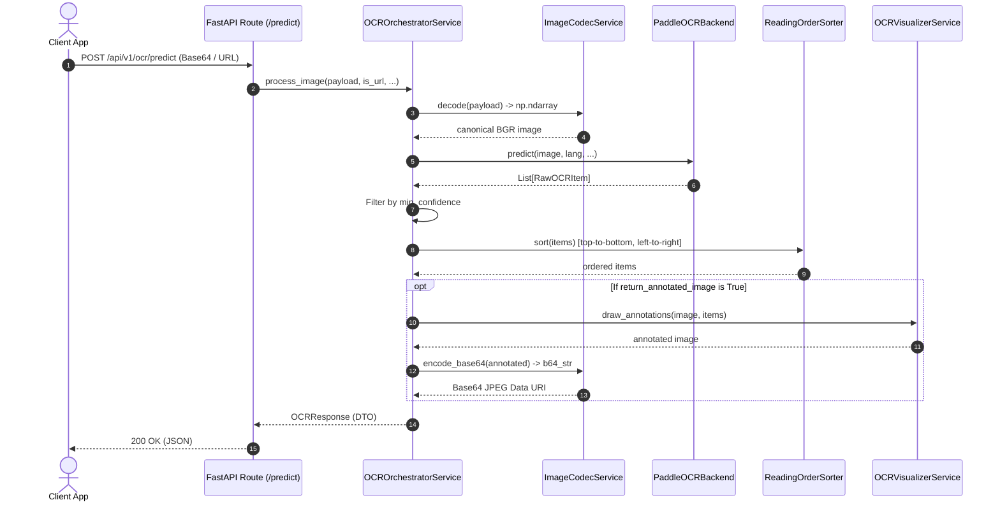

# 📐 Architecture & Design Patterns

This service is engineered following the **Universal Python Service & API Design Pattern Blueprint** outlined in [`DESIGNPATTERN.md`](../DESIGNPATTERN.md). It implements Clean Architecture, SOLID principles, and Domain-Driven Service Design.

---

## 🏗️ High-Level System Architecture

```mermaid
flowchart TD
    Client["Client (Web, Mobile, External Services)"] -->|HTTP REST Request (Base64 / Multipart / URL)| Controller["1. FastAPI Controller Layer\n(src/api/routes.py)"]
    
    subgraph Controller_Layer ["Thin Controller Layer (<= 5-10 lines per route)"]
        Controller
    end

    Controller -->|Pydantic DTOs\nOCRPredictRequest| Orchestrator["2. Domain Orchestrator Layer\n(src/services/orchestrator/ocr_orchestrator.py)"]

    subgraph Service_Domain ["Domain & Service Layer"]
        Orchestrator --> Codec["Universal Codec Adapter\n(src/services/codec/image_codec.py)"]
        Orchestrator --> BackendContract["Base OCR Interface (ABC)\n(src/services/base/base_ocr.py)"]
        Orchestrator --> OrderSorter["Reading Order Sorter\n(src/utils/ordering.py)"]
        Orchestrator --> Visualizer["Visual Annotator\n(src/services/visualizer/annotator.py)"]
        
        BackendContract -.->|implements| PaddleImpl["PaddleOCRBackend\n(src/services/ocr/paddle_backend.py)"]
        BackendContract -.->|implements| MockImpl["MockOCRBackend\n(src/services/ocr/mock_backend.py)"]
        
        Factory["OCRFactory\n(src/services/ocr/factory.py)"] -->|instantiates| PaddleImpl
        Factory -->|instantiates| MockImpl
    end

    Orchestrator -->|OCRResponse DTO| Controller
    Controller -->|JSON Response & Metadata| Client
```

---

## 🧩 The 6 Core Design Patterns Applied

| Pattern | Location | Responsibility |
| :--- | :--- | :--- |
| **1. Service Class Pattern** | [`src/services/`](../src/services/) | Isolates model inference, image decoding, and OCR math completely from API controllers. |
| **2. Strategy Pattern (`ABC`)** | [`src/services/base/base_ocr.py`](../src/services/base/base_ocr.py) | Defines the contract (`BaseOCRBackend`) enabling transparent swapping between OCR engines (PaddleOCR, MockOCR, Tesseract, etc.). |
| **3. Factory & Registry** | [`src/services/ocr/factory.py`](../src/services/ocr/factory.py) | Dynamic backend resolution and lifecycle caching based on configuration (`settings.ocr_backend`). |
| **4. Domain Orchestrator (Facade)** | [`src/services/orchestrator/ocr_orchestrator.py`](../src/services/orchestrator/ocr_orchestrator.py) | Coordinates the multi-step OCR workflow (Decode $\rightarrow$ Infer $\rightarrow$ Filter $\rightarrow$ Reading Order Sort $\rightarrow$ Annotate $\rightarrow$ DTO format). |
| **5. Universal Codec Adapter** | [`src/services/codec/image_codec.py`](../src/services/codec/image_codec.py) | Translates diverse inputs (Base64, URLs, Multipart file bytes, numpy arrays) into canonical 3-channel BGR numpy arrays. |
| **6. Data Transfer Object (DTO)** | [`src/schemas/`](../src/schemas/) | Strictly typed Pydantic V2 models for requests (`OCRPredictRequest`) and responses (`OCRResponse`, `OCRLineItem`, `OCRMetadata`). |

---

## 🔄 End-to-End Processing Workflow


