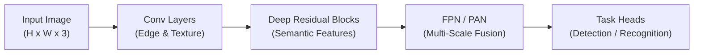
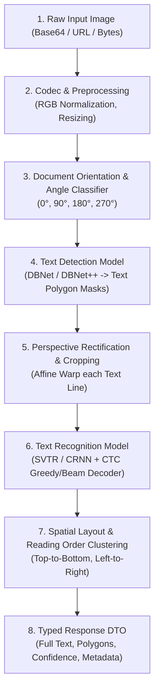

# 🧠 Foundations of AI, Computer Vision & Optical Character Recognition (OCR)

An exhaustive theoretical and mathematical guide explaining how modern Artificial Intelligence, Computer Vision, and OCR systems work from first principles to state-of-the-art deep neural architectures.

---

## 📑 Table of Contents

1. [Fundamental Principles of Computer Vision](#1-fundamental-principles-of-computer-vision)
   - [Digital Image Representation & Color Spaces](#digital-image-representation--color-spaces)
   - [Spatial Filtering & Convolutions](#spatial-filtering--convolutions)
   - [Geometric & Affine Transformations](#geometric--affine-transformations)
2. [Deep Learning for Visual Perception](#2-deep-learning-for-visual-perception)
   - [Convolutional Neural Networks (CNNs) & Inductive Bias](#convolutional-neural-networks-cnns--inductive-bias)
   - [Backbones & Feature Extraction (ResNet, MobileNet, PP-LCNet)](#backbones--feature-extraction-resnet-mobilenet-pp-lcnet)
   - [Multi-Scale Feature Aggregation (FPN & PAN)](#multi-scale-feature-aggregation-fpn--pan)
   - [Vision Transformers (ViT) & Self-Attention](#vision-transformers-vit--self-attention)
3. [The End-to-End OCR Pipeline](#3-the-end-to-end-ocr-pipeline)
   - [Pipeline Architecture Overview](#pipeline-architecture-overview)
   - [Stage 1: Document Preprocessing & Angle Rectification](#stage-1-document-preprocessing--angle-rectification)
   - [Stage 2: Text Detection & Differentiable Binarization (DBNet)](#stage-2-text-detection--differentiable-binarization-dbnet)
   - [Stage 3: Sequence Recognition & CTC Loss (CRNN & SVTR)](#stage-3-sequence-recognition--ctc-loss-crnn--svtr)
   - [Stage 4: Postprocessing, Layout Analysis & Reading Order](#stage-4-postprocessing-layout-analysis--reading-order)
4. [PaddleOCR Deep-Dive (PP-OCRv4 Architecture)](#4-paddleocr-deep-dive-pp-ocrv4-architecture)
5. [Inference Optimization & Production Engineering](#5-inference-optimization--production-engineering)

---

## 1. Fundamental Principles of Computer Vision

### Digital Image Representation & Color Spaces

A digital image is mathematically modeled as a discrete 2D or 3D tensor:

$$\mathbf{I} \in \mathbb{R}^{H \times W \times C}$$

where $H$ is image height (pixels), $W$ is image width (pixels), and $C$ represents color channels.

```
       W (Width / X-axis)
    ┌──────────────────────────┐
    │ (0,0)             (W-1,0)│
 H  │                          │
(H) │                          │
    │ (0,H-1)         (W-1,H-1)│
    └──────────────────────────┘
```

#### Color Spaces & Encodings:
- **Grayscale ($C=1$)**: Intensity values $I(x,y) \in [0, 255]$ representing luminance.
  $$Y = 0.299R + 0.587G + 0.114B$$
- **RGB / BGR ($C=3$)**: Additive color model. OpenCV natively loads images in **BGR** format (Blue, Green, Red), while PIL and web browsers expect **RGB**.
- **Normalization**: Deep neural networks require inputs scaled to zero mean and unit variance or normalized to $[0.0, 1.0]$:
  $$\hat{\mathbf{I}} = \frac{\mathbf{I} - \mu}{\sigma}$$

---

### Spatial Filtering & Convolutions

Classical computer vision relies on discrete 2D spatial convolution of an image $I$ with a parameterized kernel $K \in \mathbb{R}^{k_h \times k_w}$:

$$(I * K)(x, y) = \sum_{i=-a}^{a} \sum_{j=-b}^{b} I(x - i, y - j) \cdot K(i, j)$$

```
Input Patch (3x3)          Kernel (3x3)              Output Pixel
┌───┬───┬───┐             ┌───┬───┬───┐
│ 1 │ 2 │ 0 │             │-1 │ 0 │ 1 │
├───┼───┼───┤      *      ├───┼───┼───┤      ───►        [ 4 ]
│ 0 │ 1 │ 3 │             │-2 │ 0 │ 2 │             (Sobel Gradient)
├───┼───┼───┤             ├───┼───┼───┤
│ 2 │ 1 │ 1 │             │-1 │ 0 │ 1 │
└───┴───┴───┘             └───┴───┴───┘
```

- **Sobel / Scharr Filters**: Compute directional intensity gradients $\nabla I = \left[ \frac{\partial I}{\partial x}, \frac{\partial I}{\partial y} \right]^T$ to extract object edges.
- **Gaussian Blur**: Attenuates high-frequency noise using a 2D Gaussian density function $G(x,y) = \frac{1}{2\pi\sigma^2} e^{-\frac{x^2+y^2}{2\sigma^2}}$.

---

### Geometric & Affine Transformations

When documents are photographed, perspective distortion occurs. Affine transformations map 2D coordinates $(x, y)$ to $(x', y')$ using a $3 \times 3$ transformation matrix $\mathbf{M}$:

$$\begin{bmatrix} x' \\ y' \\ 1 \end{bmatrix} = \mathbf{M} \begin{bmatrix} x \\ y \\ 1 \end{bmatrix} = \begin{bmatrix} a_{11} & a_{12} & t_x \\ a_{21} & a_{22} & t_y \\ 0 & 0 & 1 \end{bmatrix} \begin{bmatrix} x \\ y \\ 1 \end{bmatrix}$$

For non-parallel perspective distortion (e.g. document photographed at an angle), **Perspective / Homography Transformation** uses 4 point pairs:

$$\begin{bmatrix} x' \\ y' \\ 1 \end{bmatrix} \sim \begin{bmatrix} h_{11} & h_{12} & h_{13} \\ h_{21} & h_{22} & h_{23} \\ h_{31} & h_{32} & h_{33} \end{bmatrix} \begin{bmatrix} x \\ y \\ 1 \end{bmatrix}$$

---

## 2. Deep Learning for Visual Perception



### Convolutional Neural Networks (CNNs) & Inductive Bias

CNNs leverage two core spatial inductive biases:
1. **Translation Equivariance**: A feature detector (e.g. character curve) learned in one corner of an image behaves identically in any other corner:
   $$f(g(x)) = g(f(x))$$
2. **Locality of Reference**: Nearby pixels share high spatial correlation.

#### Receptive Field Growth:
As convolutional layers with kernel size $k$ and stride $s$ stack, the effective receptive field $RF_l$ at layer $l$ expands:

$$RF_l = RF_{l-1} + (k_l - 1) \cdot \prod_{i=1}^{l-1} s_i$$

---

### Backbones & Feature Extraction

Modern vision networks balance representational capacity against inference latency:

1. **ResNet (Residual Networks)**: Introduces skip connections solving the vanishing gradient problem:
   $$\mathbf{y} = \mathcal{F}(\mathbf{x}, \{W_i\}) + \mathbf{x}$$
2. **MobileNetV3**: Utilizes Depthwise Separable Convolutions (splitting standard convolution into depthwise spatial filtering and $1 \times 1$ pointwise channel projection) reducing compute cost by $\approx \frac{1}{N} + \frac{1}{D_k^2}$.
3. **PP-LCNet (Paddle Lightweight CPU Network)**: Tailored for ultra-fast CPU inference via depthwise convolutions, large-kernel depthwise layers, and lightweight squeeze-and-excitation (SE) attention.

---

### Multi-Scale Feature Aggregation (FPN & PAN)

Text in images varies drastically in scale (e.g., billboards vs fine invoice print). Single-layer feature maps fail to capture both small and large text.

- **Feature Pyramid Network (FPN)**: Fuses top-down rich semantic features with bottom-up high-resolution localization features via lateral $1 \times 1$ projections and bilinear upsampling.
- **Path Aggregation Network (PAN)**: Adds an extra bottom-up pathway to propagate low-level spatial edge signals back to the prediction heads.

```
       FPN (Top-Down)                PAN (Bottom-Up)
   [P5] ──► [Upsample] ──► [P4]      [N4] ──► [Downsample] ──► [N5]
     ▲                       ▲         ▲                         ▲
   [C5]                     [C4]      [P4]                      [P5]
 (Coarse/Deep)           (Fine/Shallow)
```

---

## 3. The End-to-End OCR Pipeline

An industrial OCR system is not a single model, but an orchestrated multi-stage pipeline:



---

### Stage 1: Document Preprocessing & Angle Rectification

Documents and captured images frequently arrive upside down or rotated sideways.
1. **Document Orientation Classifier**: A lightweight CNN classifies the overall rotation angle $\theta \in \{0^\circ, 90^\circ, 180^\circ, 270^\circ\}$.
2. **Image Rotation**: The image tensor is rotated by $-\theta$ prior to text detection.
3. **Textline Direction Classifier**: Corrects individual 180° inverted text patches before feeding them to the recognition model.

---

### Stage 2: Text Detection & Differentiable Binarization (DBNet)

Traditional segmentation models produce continuous probability heatmaps $P$. Converting $P$ to a binary bounding polygon requires thresholding with a non-differentiable step function:

$$B_{i,j} = \begin{cases} 1 & \text{if } P_{i,j} \ge T \\ 0 & \text{otherwise} \end{cases}$$

Because standard thresholding is non-differentiable, backpropagation cannot optimize the binarization boundary end-to-end.

#### The DBNet Innovation:
**Differentiable Binarization (DB)** replaces the hard step function with an approximate differentiable step function:

$$\hat{B}_{i,j} = \frac{1}{1 + e^{-k(P_{i,j} - T_{i,j})}}$$

where:
- $P \in \mathbb{R}^{H \times W}$ is the predicted probability map.
- $T \in \mathbb{R}^{H \times W}$ is the predicted adaptive threshold map.
- $k$ is the amplification factor (typically $k=50$).

```
           Differentiable Step Function (k=50)
    1.0 ┬                             ┌──────────────
        │                            │
  B_hat │                           │
        │                          │
    0.5 ┼─────────────────────────┼ (P = T)
        │                        │
        │                       │
    0.0 ┴─────────────┘
        ─────────────────────────────────────────────►
                       (P - T)
```

#### Multi-Task Loss Function:
The total detection loss $\mathcal{L}_{det}$ is a weighted sum of the probability map loss $\mathcal{L}_s$, binary map loss $\mathcal{L}_b$, and threshold map loss $\mathcal{L}_t$:

$$\mathcal{L}_{det} = \mathcal{L}_s(P, Y) + \alpha \mathcal{L}_b(\hat{B}, Y) + \beta \mathcal{L}_t(T, G)$$

- $\mathcal{L}_s$ and $\mathcal{L}_b$: Binary Cross-Entropy (BCE) with Online Hard Example Mining (OHEM) or Dice Loss.
- $\mathcal{L}_t$: Smooth $L_1$ loss between predicted threshold $T$ and ground-truth boundary distance map $G$.

#### Polygon Expansion via Vatti Clipping:
The shrunk ground-truth polygon $G_s$ is generated during training by shrinking polygon $G$ with offset $D$:

$$D = \frac{A(1 - r^2)}{L}$$

where $A$ is the polygon area, $L$ is the polygon perimeter, and $r$ is the shrink ratio (e.g. $0.4$). During inference, predicted contours are unclipped back to original text boundaries using the inverse expansion offset $D' = \frac{A' \cdot \text{unclip\_ratio}}{L'}$.

---

### Stage 3: Sequence Recognition & CTC Loss (CRNN & SVTR)

Once text bounding boxes are detected, each text line patch is cropped, normalized to fixed height (e.g. $48$ px), and passed to the **Text Recognizer**.

```
Input Line Patch ──► CNN / SVTR Feature Map ──► BiLSTM / Attention ──► CTC Decoder ──► "TOTAL: $199.00"
 [48 x W x 3]           [C x W/4]                   [W/4 x Vocab]
```

#### The Alignment Problem:
In text recognition, the number of input image feature slices $T = W/4$ does not match the target string length $U$ ($T \ge U$). We do not know which image column corresponds to which character.

#### Connectionist Temporal Classification (CTC):
CTC introduces a special **blank token** $\epsilon$ to represent non-character gaps between characters.

1. At each time-step $t \in [1, T]$, the network outputs a softmax probability distribution over vocabulary $\Omega \cup \{\epsilon\}$:
   $$y_t^k = P(\pi_t = k \mid \mathbf{x})$$
2. A sequence path $\pi = (\pi_1, \pi_2, \dots, \pi_T)$ has probability:
   $$P(\pi \mid \mathbf{x}) = \prod_{t=1}^T y_t^{\pi_t}$$
3. A collapse mapping function $\mathcal{B}$ removes sequential duplicate characters and blanks $\epsilon$:
   $$\mathcal{B}(\text{"- - h h e e - l l - l l o o -"}) = \text{"hello"}$$
4. The conditional probability of target label sequence $\mathbf{l}$ is the marginal sum over all valid paths:
   $$P(\mathbf{l} \mid \mathbf{x}) = \sum_{\pi \in \mathcal{B}^{-1}(\mathbf{l})} P(\pi \mid \mathbf{x})$$
5. **CTC Loss**: Minimized using dynamic programming (Forward-Backward algorithm):
   $$\mathcal{L}_{CTC} = -\ln P(\mathbf{l} \mid \mathbf{x})$$

#### Decoding Strategies:
- **Greedy (Best-Path) Decoding**: Picks $\arg\max_k y_t^k$ at each time step and applies $\mathcal{B}$. Fast and effective ($O(T)$).
- **Prefix Beam Search**: Maintains top-$K$ candidate word prefixes, accumulating probabilities across identical collapsed labels ($O(T \cdot K \cdot \log K)$).

---

### Stage 4: Postprocessing, Layout Analysis & Reading Order

Detections are extracted as independent geometric polygons. To assemble coherent human-readable documents:

1. **Confidence Filtering**: Discards false positives where model confidence $c < \tau_{min}$.
2. **Reading Order Spatial Clustering Algorithm**:
   - Computes centroid $y_{center} = \frac{y_{min} + y_{max}}{2}$ and line height $h = y_{max} - y_{min}$.
   - Groups boxes into the same horizontal text line if:
     $$|y_{center}^{(i)} - y_{center}^{(j)}| \le 0.6 \times \frac{h_i + h_j}{2}$$
   - Sorts boxes in each line horizontally ($x_{min}$ ascending).
   - Sorts lines vertically ($y_{min}$ ascending).

---

## 4. PaddleOCR Deep-Dive (PP-OCRv4 Architecture)

PP-OCRv4 achieves industry-leading accuracy-to-speed ratios on commodity CPUs:

| Component | PP-OCRv4 Architecture | Innovation |
| :--- | :--- | :--- |
| **Detection Backbone** | **PP-LCNetV2** | Large $5 \times 5$ depthwise kernels, RepGhost modules, SE attention |
| **Detection Neck** | **RSE-FPN / PAN** | Residual Squeeze-and-Excitation feature pyramid |
| **Detection Head** | **DBNet++** | Adaptive Scale Fusion (ASF) with dynamic threshold estimation |
| **Recognition Backbone**| **SVTR-LCNet** | Single Visual Model for Text Recognition (combines local visual sub-patches with self-attention) |
| **Loss & Head** | **GTC (Guided Training of CTC)** | Dual-branch training: CTC branch for fast inference + Transformer Attention branch for training supervision |
| **Orientation Head** | **PPLCNet_x1_0** | Ultra-lightweight direction classifier (0.5 ms latency) |

---

## 5. Inference Optimization & Production Engineering

### System Design & Architectural Invariants

Connecting theory to the implementation in this repository:

1. **Dependency Inversion Principle (DIP)**: High-level business logic in [`OCROrchestratorService`](../src/services/orchestrator/ocr_orchestrator.py) communicates with the OCR engine solely through [`BaseOCRBackend`](../src/services/base/base_ocr.py), allowing transparent model swapping without code modifications.
2. **Universal Codec**: Decouples incoming network encoding (Base64 data URIs, multipart byte streams, remote URLs) from computational arrays.
3. **Thread Safety & Lifecycle Management**:
   - Model weights are loaded once in memory during FastAPI startup (`lifespan`).
   - Inference uses thread synchronization locks to prevent concurrent runtime corruption on CPU/GPU tensors.
4. **Environment Isolation**: Configured flags (`PADDLE_PDX_ENABLE_MKLDNN_BYDEFAULT=0`, `FLAGS_enable_pir_api=0`) prevent oneDNN/PIR executor conflicts on non-AVX or heterogeneous CPU hosts.
