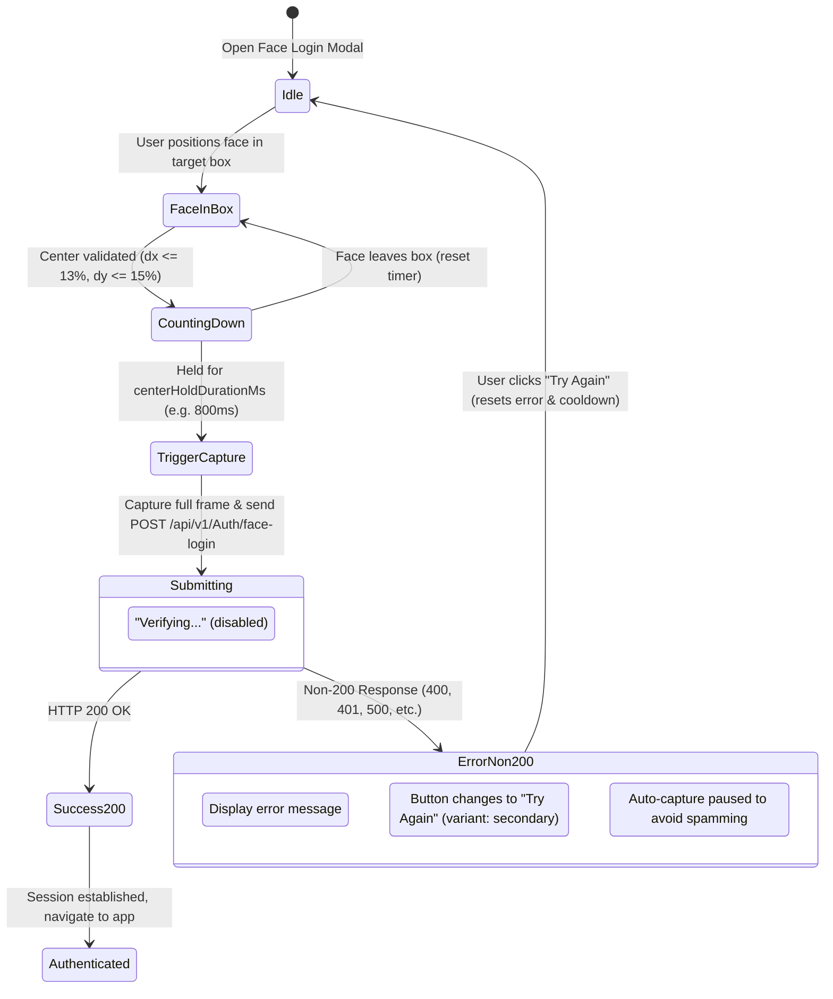
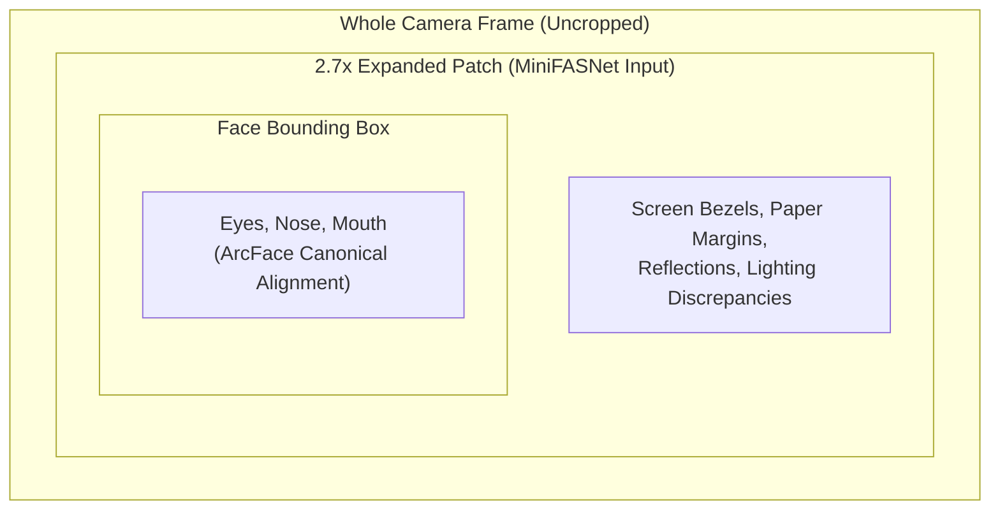

# 📝 Change Summary & Technical Notes: Face Detection & Authentication

**Project**: Face Authentication & Recognition System  
**Date**: September 29, 2026  
**Scope**: Frontend Camera Capture (`AI/FaceAuthentication/Detection/Front-end`) & Backend Integration (`AI/FaceAuthentication/Recognition`)

---

## 📌 Executive Summary

This document details all files modified to implement the requirements:
1. **Send the whole image to the backend**: Updated the camera capture pipeline so that the entire uncropped video frame (`video.videoWidth` $\times$ `video.videoHeight`) is captured as a high-quality JPEG blob and transmitted to backend authentication and registration endpoints, replacing cropped face bounding boxes.
2. **Auto-send request whenever face is centered in the box**: Implemented real-time face centering detection, visual biometric targeting guide with corner brackets, stability countdown ($800\text{ ms}$ hold timer), camera shutter flash effect, and automated request dispatch without requiring manual button clicks.
3. **Non-200 Response Retry Handling**: When the backend returns a non-200 response (e.g. 400 Bad Request, 401 Unauthorized, 500 Internal Error, or network failure), auto-capture is paused to avoid spamming the backend, and the submit button changes dynamically into **"Try Again"**. Clicking "Try Again" clears the error and seamlessly resumes face detection and auto-capture.
4. **Configurable Wait Time**: Centralized face detection configuration in `src/config/appConfig.js` (`centerHoldDurationMs`).

---

## ⚙️ How to Configure the Wait Time to Send Requests

To adjust the wait time (the amount of time the user's face must remain inside the box before the request is automatically triggered), open:

📁 **[`src/config/appConfig.js`](file:///home/quan/projects/maivenpoint/AI/FaceAuthentication/Detection/Front-end/src/config/appConfig.js)**

```javascript
export const appConfig = {
  appName: 'EduPortal',
  // ... other configs ...

  faceAuth: {
    /**
     * Wait time (in milliseconds) the face must stay inside the box before sending the request.
     * Default: 800ms (0.8 seconds).
     * 
     * Examples:
     * - 500  -> Fast response (0.5s)
     * - 800  -> Balanced (0.8s) - recommended
     * - 1200 -> Deliberate hold (1.2s)
     */
    centerHoldDurationMs: 800,

    /**
     * Cooldown time (in milliseconds) after an attempt before re-enabling auto-trigger.
     */
    cooldownMs: 2500,

    /**
     * Minimum confidence score required for face detection (0.0 to 1.0).
     */
    minDetectionConfidence: 0.5,
  },
};
```

---

## 📂 List of Modified Files

| # | File Path | Type | Purpose |
| :-: | :--- | :---: | :--- |
| **1** | [`src/config/appConfig.js`](file:///home/quan/projects/maivenpoint/AI/FaceAuthentication/Detection/Front-end/src/config/appConfig.js) | **Modified** | Centralized configuration for `faceAuth.centerHoldDurationMs`, `cooldownMs`, and `minDetectionConfidence`. |
| **2** | [`src/features/auth/components/FaceRecognition/FaceDetection.jsx`](file:///home/quan/projects/maivenpoint/AI/FaceAuthentication/Detection/Front-end/src/features/auth/components/FaceRecognition/FaceDetection.jsx) | **Modified** | Full-frame uncropped capture, centering evaluation, reticle overlay, auto-trigger with configurable hold duration, and paused state handling. |
| **3** | [`src/features/auth/components/FaceRecognition/FaceDetection.scss`](file:///home/quan/projects/maivenpoint/AI/FaceAuthentication/Detection/Front-end/src/features/auth/components/FaceRecognition/FaceDetection.scss) | **Modified** | Styles for biometric guidance banner, centering glow, aligning pulse animation, and shutter flash effect. |
| **4** | [`src/features/auth/components/LoginForm/LoginForm.jsx`](file:///home/quan/projects/maivenpoint/AI/FaceAuthentication/Detection/Front-end/src/features/auth/components/LoginForm/LoginForm.jsx) | **Modified** | Face Login modal: sends whole image blob, switches button to **"Try Again"** upon non-200 responses, pauses auto-capture on error, and resumes on retry click. |
| **5** | [`src/components/layout/admin/AdminSettings/Settings.jsx`](file:///home/quan/projects/maivenpoint/AI/FaceAuthentication/Detection/Front-end/src/components/layout/admin/AdminSettings/Settings.jsx) | **Modified** | Admin face registration: sends whole frame, switches button to **"Try Again"** upon non-200 responses. |
| **6** | [`src/components/layout/student/StudentSettings/Settings.jsx`](file:///home/quan/projects/maivenpoint/AI/FaceAuthentication/Detection/Front-end/src/components/layout/student/StudentSettings/Settings.jsx) | **Modified** | Student face registration: sends whole frame, switches button to **"Try Again"** upon non-200 responses. |
| **7** | [`NOTE.md`](file:///home/quan/projects/maivenpoint/AI/FaceAuthentication/Detection/Front-end/NOTE.md) | **Updated** | Comprehensive technical documentation and change log (this file). |

---

## 🔄 State Transition: "Try Again" Button & Retry Flow



---

## 🏗️ Backend Context: Why the Whole Image is Required

MiniFASNet (Face Anti-Spoofing) operates on a **$2.7\times$ context-expanded crop**:



1. **Spoof Attack Detection**: When an attacker replays a face on an iPad or printed cardboard, the spoof cues (moire patterns, glass reflections, screen edges) exist **outside** the tight face bounding box.
2. **Pipeline Integrity**:
   - Frontend captures **whole frame** $\rightarrow$ sends to backend.
   - Backend detects face $\rightarrow$ extracts $2.7\times$ patch for MiniFASNet liveness check.
   - If spoofing is detected $\rightarrow$ rejects with `400 Bad Request`.
   - If genuine human $\rightarrow$ normalizes to $112\times 112$ canonical alignment and extracts 512-D ArcFace embedding.

---

## 🧪 Verification & Build Status

1. **Frontend Production Build**:
   ```bash
   npm --prefix AI/FaceAuthentication/Detection/Front-end run build
   ```
   **Output**:
   ```text
   vite v8.3.0 building client environment for production...
   ✓ 2372 modules transformed.
   dist/index.html                   0.45 kB
   dist/assets/index-B5RgCKKq.css   57.43 kB
   dist/assets/index-BGUqXUe0.js   942.19 kB
   ✓ built in 1.15s
   ```
   Zero build errors or syntax warnings.

2. **Backend Automated Tests**:
   ```bash
   cd AI/FaceAuthentication/Recognition && ./venv/bin/pytest tests/
   ```
   **Output**:
   ```text
   tests/test_api_endpoints.py .............. [100%]
   14 passed in 1.98s
   ```
