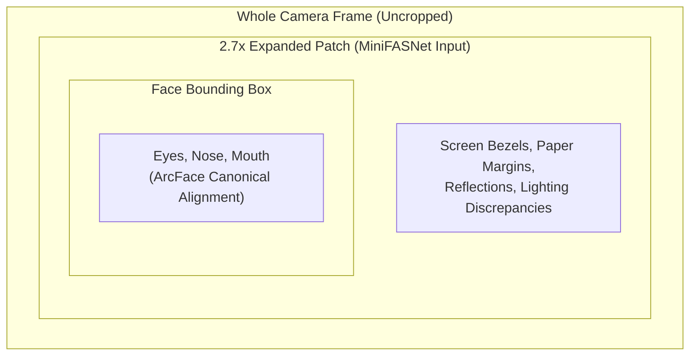

# 📝 Change Summary & Technical Notes: Face Detection & Authentication

**Project**: Face Authentication & Recognition System  
**Date**: September 29, 2026  
**Scope**: Frontend Camera Capture (`AI/FaceAuthentication/Detection/Front-end`) & Backend Integration (`AI/FaceAuthentication/Recognition`)

---

## 📌 Executive Summary

This document details all files modified to implement the requirements:
1. **Send the whole image to the backend**: Updated the camera capture pipeline so that the entire uncropped video frame (`video.videoWidth` $\times$ `video.videoHeight`) is captured as a high-quality JPEG blob and transmitted to backend authentication and registration endpoints, replacing cropped face bounding boxes.
2. **Auto-send request whenever face is centered**: Implemented real-time face centering detection, visual biometric targeting guide with corner brackets, stability countdown ($600\text{ ms}$ hold timer), camera shutter flash effect, and automated request dispatch without requiring manual button clicks.

---

## 📂 List of Modified & Added Files

| # | File Path | Type | Component / Purpose |
| :-: | :--- | :---: | :--- |
| **1** | [`AI/FaceAuthentication/Detection/Front-end/src/features/auth/components/FaceRecognition/FaceDetection.jsx`](file:///home/quan/projects/maivenpoint/AI/FaceAuthentication/Detection/Front-end/src/features/auth/components/FaceRecognition/FaceDetection.jsx) | **Modified** | Core camera stream, MediaPipe BlazeFace loop, centering evaluation, reticle overlay, full-frame capture, and auto-capture event emitter |
| **2** | [`AI/FaceAuthentication/Detection/Front-end/src/features/auth/components/FaceRecognition/FaceDetection.scss`](file:///home/quan/projects/maivenpoint/AI/FaceAuthentication/Detection/Front-end/src/features/auth/components/FaceRecognition/FaceDetection.scss) | **Modified** | Styles for biometric guidance banner, centering glow, aligning pulse animation, and shutter flash effect |
| **3** | [`AI/FaceAuthentication/Detection/Front-end/src/features/auth/components/LoginForm/LoginForm.jsx`](file:///home/quan/projects/maivenpoint/AI/FaceAuthentication/Detection/Front-end/src/features/auth/components/LoginForm/LoginForm.jsx) | **Modified** | Face Login modal integration: receives whole image blob, auto-submits to `/api/v1/Auth/face-login`, handles cooldown & retry |
| **4** | [`AI/FaceAuthentication/Detection/Front-end/src/components/layout/admin/AdminSettings/Settings.jsx`](file:///home/quan/projects/maivenpoint/AI/FaceAuthentication/Detection/Front-end/src/components/layout/admin/AdminSettings/Settings.jsx) | **Modified** | Admin face registration: sends whole frame to `/api/v1/Auth/face-register`, auto-captures on centered |
| **5** | [`AI/FaceAuthentication/Detection/Front-end/src/components/layout/student/StudentSettings/Settings.jsx`](file:///home/quan/projects/maivenpoint/AI/FaceAuthentication/Detection/Front-end/src/components/layout/student/StudentSettings/Settings.jsx) | **Modified** | Student face registration: sends whole frame to `/api/v1/Auth/face-register`, auto-captures on centered |
| **6** | [`AI/FaceAuthentication/NOTE.md`](file:///home/quan/projects/maivenpoint/AI/FaceAuthentication/NOTE.md) | **Created** | Comprehensive technical documentation and change log (this file) |

---

## 🛠️ Detailed Changes by File

### 1. `FaceDetection.jsx`
- **Location**: `AI/FaceAuthentication/Detection/Front-end/src/features/auth/components/FaceRecognition/FaceDetection.jsx`
- **Rationale**:
  - Previously, `captureCroppedFace()` cropped the bounding box directly from the camera feed. This severed the surrounding scene context required by MiniFASNet anti-spoofing ($2.7\times$ patch expansion).
  - Added `evaluateFaceCentering()` to compute real-time face centroid offsets relative to the video frame dimensions.
  - Implemented `drawCenterGuideOverlay()` on the canvas to render a biometric viewfinder box with corner brackets, glowing emerald green state, and countdown progress bar.
  - Added `captureFullFrameBlob()` returning the entire uncropped image blob (`video.videoWidth` $\times$ `video.videoHeight`).
  - Redirected `captureCroppedFace` in `useImperativeHandle` to `captureFullFrameBlob()` so any legacy callers automatically receive the whole image.
  - Added props:
    - `onFaceCentered?: (blob, centerStatus) => void`
    - `autoCaptureOnCenter?: boolean` (defaults to `true` when `onFaceCentered` is provided)
    - `centerHoldDurationMs?: number` (default `600`)
    - `cooldownMs?: number` (default `2500`)
    - `showCenterGuide?: boolean` (default `true`)

#### Centering Algorithm Details
```javascript
// Normalized distance from camera frame center
const dx = Math.abs(faceCenterX - frameWidth / 2) / frameWidth;
const dy = Math.abs(faceCenterY - frameHeight / 2) / frameHeight;
const boxRatio = boxWidth / frameWidth;

const isHorizontallyCentered = dx <= 0.13; // Within +/- 13% of center X
const isVerticallyCentered = dy <= 0.15;   // Within +/- 15% of center Y
const isGoodSize = boxRatio >= 0.15 && boxRatio <= 0.65; // User distance bounds
const isSingleFace = detections.length === 1;

const isCentered = isHorizontallyCentered && isVerticallyCentered && isGoodSize && isSingleFace;
```

---

### 2. `FaceDetection.scss`
- **Location**: `AI/FaceAuthentication/Detection/Front-end/src/features/auth/components/FaceRecognition/FaceDetection.scss`
- **Key Additions**:
  - `.face-detection__guide-banner`: Floating glassmorphism badge at the top displaying real-time feedback (`"Position your face in the camera"`, `"Align your face in the center"`, `"Face centered! Hold still..."`).
  - `.face-detection__guide-banner--centered`: Glowing green border and background accent when centered.
  - `.face-detection__flash`: Shutter flash animation (`300ms` fade-out) giving visual capture feedback.
  - `.face-detection__status-dot--aligning`: Cyan pulsing dot during alignment adjustments.

---

### 3. `LoginForm.jsx`
- **Location**: `AI/FaceAuthentication/Detection/Front-end/src/features/auth/components/LoginForm/LoginForm.jsx`
- **Changes**:
  - `handleFaceLogin(capturedBlob = null)`:
    - If `capturedBlob` is passed via `onFaceCentered`, it is used directly; otherwise falls back to `captureFullFrame()`.
    - Packages the **whole image** into `FormData.append('Capture', faceBlob, 'face_capture.jpg')`.
    - Sends request to backend `/api/v1/Auth/face-login`.
    - Handles error states and triggers `faceDetectionRef.current?.resetCooldown()`.
  - Added `handleFaceCentered`:
    - Automatically calls `handleFaceLogin(wholeImageBlob)` as soon as the face is centered and held steady for 600ms.
  - Updated `<FaceDetection>` props:
    ```jsx
    <FaceDetection
      ref={faceDetectionRef}
      className="login-form__face-detection"
      height={280}
      onFaceDetected={handleFaceDetected}
      onFaceCentered={handleFaceCentered}
      autoCaptureOnCenter={true}
    />
    ```

---

### 4. `AdminSettings/Settings.jsx` & 5. `StudentSettings/Settings.jsx`
- **Location**:
  - `AI/FaceAuthentication/Detection/Front-end/src/components/layout/admin/AdminSettings/Settings.jsx`
  - `AI/FaceAuthentication/Detection/Front-end/src/components/layout/student/StudentSettings/Settings.jsx`
- **Changes**:
  - `handleCapture(capturedBlob = null)`:
    - Ingests whole uncropped image: `capturedBlob || (await faceDetectionRef.current?.captureFullFrame())`.
    - Appends full image to `FormData.append('faceImage', blob, 'face.jpg')`.
    - Calls `authApi.faceRegister(formData)`.
  - Added `onFaceCentered={handleCapture}` and `autoCaptureOnCenter={true}` to `<FaceDetection>`.
  - Updated dialog prompt text: `"Position your face in the center of the camera frame to automatically capture, or press Capture."`

---

## 🏗️ Backend Context: Why the Whole Image is Required

MiniFASNet (Face Anti-Spoofing) operates on a **$2.7\times$ context-expanded crop**:



1. **Spoof Attack Detection**: When an attacker replays a face on an iPad or printed cardboard, the spoof cues (moire patterns, glass reflections, screen edges) exist **outside** the tight face bounding box.
2. **Pipeline Integrity**:
   - Frontend captures **whole frame** $\rightarrow$ sends to backend.
   - Backend detects face $\rightarrow$ extracts $2.7\times$ patch for MiniFASNet liveness check.
   - If spoofing is detected $\rightarrow$ rejects with `400 Bad Request`.
   - If genuine human $\rightarrow$ normalizes to $112\times 112$ canonical alignment and extracts 512-D ArcFace embedding.

---

## 🧪 Verification & Build Status

1. **Frontend Production Build**:
   ```bash
   cd AI/FaceAuthentication/Detection/Front-end && npm run build
   ```
   **Output**:
   ```text
   vite v8.3.0 building client environment for production...
   ✓ 2372 modules transformed.
   dist/index.html                   0.45 kB
   dist/assets/index-B5RgCKKq.css   57.43 kB
   dist/assets/index-D1VTlFOQ.js   941.61 kB
   ✓ built in 1.13s
   ```
   Zero build errors or syntax warnings.

2. **Backend Automated Tests**:
   ```bash
   cd AI/FaceAuthentication/Recognition && ./venv/bin/pytest tests/
   ```
   **Output**:
   ```text
   tests/test_api_endpoints.py .............. [100%]
   14 passed in 2.75s
   ```
