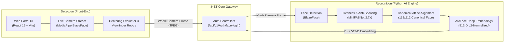

# Face Authentication System

Unified Face Authentication & Recognition platform integrating high-performance facial biometrics, presentation attack detection (anti-spoofing), and user authentication for the learning portal.

---

## 🏛️ Subsystems Overview

### 1. `Detection/` (Front-end Web Application)
- **Tech Stack**: React 19, Vite, Sass, MediaPipe `@mediapipe/tasks-vision`, Lucide icons.
- **Features**:
  - In-browser face localization using MediaPipe BlazeFace.
  - Automatic centering detection: calculates centroid offsets ($\Delta x \le 13\%$, $\Delta y \le 15\%$) and size bounds.
  - Interactive biometric HUD viewfinder with corner brackets and hold-progress timer ($600\text{ ms}$).
  - Full-frame capture streaming the entire uncropped image to the backend to preserve anti-spoofing context.

### 2. `Recognition/` (AI Biometrics Engine)
- **Tech Stack**: Python 3.12, FastAPI, ONNX Runtime, OpenCV, Pytest.
- **Features**:
  - Modular service class hierarchy with Abstract Base Classes & Factory pattern.
  - Anti-spoofing defense with MiniFASNet ($2.7\times$ expanded context patch to detect print and screen attacks).
  - ArcFace deep metric feature extractor generating 512-D L2-normalized embeddings.
  - Secure `/api/v1/embedding/live` endpoint performing Detection $\rightarrow$ Liveness Verification $\rightarrow$ Canonical Alignment $\rightarrow$ Pure Embedding output.

---

## 📚 Documentation Links

- [Technical Change Notes & Architecture](file:///home/quan/projects/maivenpoint/AI/FaceAuthentication/NOTE.md)
- [REST API Reference](file:///home/quan/projects/maivenpoint/AI/FaceAuthentication/Recognition/docs/API_REFERENCE.md)
- [Microservice Architecture & Design Patterns](file:///home/quan/projects/maivenpoint/AI/FaceAuthentication/Recognition/docs/ARCHITECTURE.md)
- [Project Plan](file:///home/quan/projects/maivenpoint/AI/FaceAuthentication/PLAN.md)
