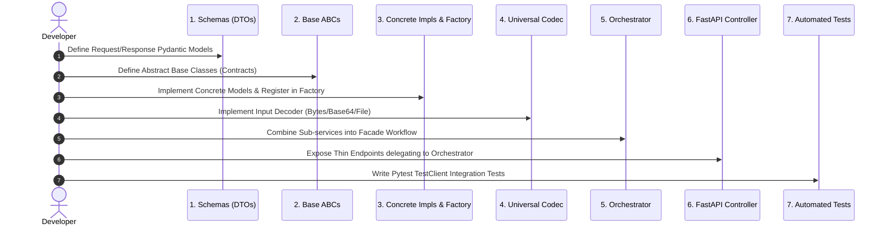

# 📐 Universal Python Service & API Design Pattern Blueprint

A reusable, production-ready architectural blueprint for building scalable, extensible, and maintainable Python API applications (AI/ML, RAG, Computer Vision, Microservices, E-commerce, Data Pipelines).

---

## 🌟 Core Philosophy & Architectural Principles

This design pattern combines **Clean Architecture**, **SOLID Principles**, and **Domain-Driven Service Design**:

```
+-----------------------------------------------------------------------------------+
|                              1. CLIENT / CONTROLLER LAYER                         |
|   FastAPI Routes / CLI Entrypoints / Message Queue Consumers (Zero Business Logic)|
+-----------------------------------------------------------------------------------+
                                         │
                                         ▼ (DTOs / Pydantic Models)
+-----------------------------------------------------------------------------------+
|                           2. DOMAIN ORCHESTRATOR LAYER                            |
|             Facade coordinating multi-stage business pipelines & workflows        |
+-----------------------------------------------------------------------------------+
                                         │
                   ┌─────────────────────┼─────────────────────┐
                   ▼                     ▼                     ▼
+----------------------+ +----------------------+ +----------------------+
| 3. SERVICE BACKEND A | | 3. SERVICE BACKEND B | | 3. UNIVERSAL CODEC   |
| (Strategy + Factory) | | (Strategy + Factory) | | (Payload Adapter)    |
+----------------------+ +----------------------+ +----------------------+
                   │                     │                     │
                   ▼                     ▼                     ▼
+-----------------------------------------------------------------------------------+
|                        4. ABSTRACT BASE INTERFACES (ABCs)                         |
|       Formal contracts guaranteeing swappability & Dependency Inversion (DIP)     |
+-----------------------------------------------------------------------------------+
```

---

## 🧩 The 6 Core Design Patterns Explained

### 1. 🏛️ Service Class Pattern (Separation of Concerns)
- **Problem**: Putting business logic, model calls, or database operations directly inside API route handlers creates "fat controllers" that are impossible to test or reuse in CLI/background workers.
- **Solution**: Route handlers only parse HTTP requests and delegate execution to dedicated **Service Classes**.
- **Rule**: A route handler must never contain more than 5–10 lines of code.

---

### 2. 📜 Strategy Pattern with Abstract Base Classes (`ABC`)
- **Problem**: Hardcoding a specific library or model (e.g. `MediaPipe` or `ArcFace`) makes switching to alternatives (e.g. `RetinaFace` or `AdaFace`) require rewriting the whole application.
- **Solution**: Define a **Root Abstract Base Interface** that specifies the public contract. Every model backend inherits from this root class.
- **Code Skeleton**:
  ```python
  from abc import ABC, abstractmethod

  class BaseProcessorService(ABC):
      @abstractmethod
      def process(self, input_data: dict) -> dict:
          """Every concrete backend must implement this method."""
          pass

      @property
      @abstractmethod
      def backend_name(self) -> str:
          """Human-readable backend identifier."""
          pass
  ```

---

### 3. 🏭 Factory Method & Extensible Registry Pattern
- **Problem**: Callers shouldn't need to know *how* to instantiate specific models or backends.
- **Solution**: A **Factory** maintains a registry dictionary of available classes and instantiates the correct service dynamically based on configuration or environment variables.
- **Code Skeleton**:
  ```python
  from typing import Dict, Type

  class ServiceFactory:
      _registry: Dict[str, Type[BaseProcessorService]] = {}

      @classmethod
      def register(cls, name: str, service_cls: Type[BaseProcessorService]):
          cls._registry[name.lower()] = service_cls

      @classmethod
      def create(cls, backend_name: str = "default", **kwargs) -> BaseFaceProcessorService:
          name = backend_name.lower()
          if name not in cls._registry:
              raise ValueError(f"Unknown backend: '{name}'. Supported: {list(cls._registry.keys())}")
          return cls._registry[name](**kwargs)
  ```

---

### 4. 🎭 Facade / Domain Orchestrator Pattern
- **Problem**: End-to-end tasks often require multiple sequential steps (Decode $\rightarrow$ Detect $\rightarrow$ Preprocess $\rightarrow$ Extract Embedding $\rightarrow$ Match $\rightarrow$ Format Response). Exposing these low-level steps to the client creates tight coupling.
- **Solution**: A **High-Level Domain Orchestrator** (`FaceRecognitionService`) coordinates the sub-services behind clean, unified business methods (`verify`, `identify`, `enroll`).
- **Dependency Inversion (DIP)**: The Orchestrator depends on *abstract base interfaces*, not concrete implementations!

---

### 5. 🔌 Adapter / Universal Codec Pattern
- **Problem**: Incoming API requests can arrive in diverse formats (Base64 strings, raw bytes, multipart file uploads, numpy arrays, or URLs).
- **Solution**: An **ImageCodecService** (or `PayloadAdapterService`) ingests any input format and normalizes it into a canonical in-memory representation.

---

### 6. 📋 Data Transfer Object (DTO) Pattern with Pydantic
- **Problem**: Passing untyped raw dictionaries or tuples between layers causes runtime bugs and lacks validation.
- **Solution**: Strongly typed Pydantic models define request and response schemas, ensuring automatic validation, type coercion, and auto-generated OpenAPI documentation.

---

## 📁 Standardized Reusable Folder Template

When starting any new Python API application, replicate this exact directory structure:

```text
my_python_project/
├── config/ (or src/config.py)        # ⚙️ Environment settings & backend selectors
├── src/
│   ├── __init__.py
│   ├── config.py                     # Centralized settings (pydantic-settings / os.getenv)
│   ├── schemas/                      # 📋 Pydantic DTOs
│   │   ├── __init__.py
│   │   ├── request_schemas.py        # Input request payloads
│   │   └── response_schemas.py       # Output response models
│   ├── services/                     # 🏛️ Domain Services Layer
│   │   ├── __init__.py
│   │   ├── base/                     # Root Abstract Interfaces (ABCs)
│   │   │   ├── __init__.py
│   │   │   ├── base_feature_a.py     # BaseFeatureAService(ABC)
│   │   │   └── base_feature_b.py     # BaseFeatureBService(ABC)
│   │   ├── feature_a/                # Concrete Backend A
│   │   │   ├── __init__.py
│   │   │   ├── model_impl_1.py       # ConcreteImpl(BaseFeatureAService)
│   │   │   └── factory.py            # FeatureAFactory
│   │   ├── feature_b/                # Concrete Backend B
│   │   │   ├── __init__.py
│   │   │   ├── model_impl_2.py       # ConcreteImpl(BaseFeatureBService)
│   │   │   └── factory.py            # FeatureBFactory
│   │   ├── codec/                    # Universal Input/Output Adapters
│   │   │   ├── __init__.py
│   │   │   └── payload_codec.py      # Ingests Bytes, Base64, Files, JSON
│   │   └── orchestrator/             # High-Level Business Facade
│   │       ├── __init__.py
│   │       └── domain_service.py     # Coordinates sub-services
│   ├── api/                          # 🌐 REST Controllers (FastAPI)
│   │   ├── __init__.py
│   │   ├── app.py                    # App factory, CORS, Lifespan
│   │   └── routes.py                 # Thin endpoint definitions
│   └── utils/                        # 🛠️ Generic Helpers (I/O, Math, Metrics)
│       ├── __init__.py
│       ├── file_io.py
│       └── metrics.py
├── tests/                            # 🧪 Automated Test Suite (Pytest)
│   ├── __init__.py
│   └── test_api_endpoints.py
├── main.py                           # 🚀 Entrypoint (CLI, Web Server, Demo)
├── run_api_demo.py                   # 🎭 In-process API simulation client
├── pytest.ini                        # Pytest config
└── requirements.txt                  # Pinned dependencies
```

---

## 🛠️ Step-by-Step Guide: How to Apply This Blueprint to Any Project

Follow these 7 steps to build any new Python service:



### Step 1: Define Schemas (`src/schemas/`)
Create strict input and output DTOs using Pydantic:
```python
# src/schemas/request_schemas.py
from pydantic import BaseModel, Field

class PredictRequest(BaseModel):
    payload_base64: str = Field(..., description="Base64 encoded payload")
    threshold: float = Field(0.5, ge=0.0, le=1.0)
```

### Step 2: Define Base Interfaces (`src/services/base/`)
Define what every backend must do:
```python
# src/services/base/base_model.py
from abc import ABC, abstractmethod
import numpy as np

class BaseModelService(ABC):
    @abstractmethod
    def infer(self, tensor: np.ndarray) -> np.ndarray:
        pass

    @property
    @abstractmethod
    def model_name(self) -> str:
        pass
```

### Step 3: Implement Concrete Models & Factory (`src/services/feature/`)
Implement one or more concrete backends and wire them to a factory:
```python
# src/services/feature/onnx_model.py
class ONNXModelService(BaseModelService):
    def __init__(self, model_path: str = "models/model.onnx"):
        self.model_path = model_path
        # Init ONNX Session...

    @property
    def model_name(self) -> str:
        return "ONNX Model"

    def infer(self, tensor: np.ndarray) -> np.ndarray:
        return self.session.run(None, {"input": tensor})[0]

# src/services/feature/factory.py
class ModelFactory:
    _registry = {"onnx": ONNXModelService}

    @classmethod
    def create(cls, backend_name: str = "onnx", **kwargs) -> BaseModelService:
        return cls._registry[backend_name.lower()](**kwargs)
```

### Step 4: Implement Universal Codec (`src/services/codec/`)
Normalize diverse incoming data into the standard internal format:
```python
# src/services/codec/payload_codec.py
import base64
from typing import Union

class PayloadCodecService:
    @staticmethod
    def decode(input_data: Union[bytes, str]) -> bytes:
        if isinstance(input_data, str):
            return base64.b64decode(input_data)
        return input_data
```

### Step 5: Implement High-Level Orchestrator (`src/services/orchestrator/`)
Assemble all sub-services into unified business functions:
```python
# src/services/orchestrator/domain_service.py
from src.services.feature.factory import ModelFactory

class DomainOrchestratorService:
    def __init__(self, model_service=None):
        self.model = model_service or ModelFactory.create()

    def execute_workflow(self, raw_input):
        decoded = PayloadCodecService.decode(raw_input)
        tensor = self.preprocess(decoded)
        result = self.model.infer(tensor)
        return self.postprocess(result)
```

### Step 6: Expose via Thin FastAPI Endpoints (`src/api/`)
```python
# src/api/routes.py
from fastapi import APIRouter, Depends
from src.schemas.request_schemas import PredictRequest
from src.schemas.response_schemas import PredictResponse

router = APIRouter(prefix="/api/v1")

@router.post("/predict", response_model=PredictResponse)
def predict(req: PredictRequest, service = Depends(get_orchestrator)):
    return service.execute_workflow(req.payload_base64)
```

### Step 7: Write Automated Integration Tests (`tests/`)
Use `fastapi.testclient.TestClient` to verify endpoints without launching external servers:
```python
# tests/test_api.py
from fastapi.testclient import TestClient
from src.api.app import app

def test_predict_endpoint():
    with TestClient(app) as client:
        resp = client.post("/api/v1/predict", json={"payload_base64": "...", "threshold": 0.5})
        assert resp.status_code == 200
        assert resp.json()["success"] is True
```

---

## 💡 Real-World Examples Adapting This Blueprint

| Domain | Feature A (Factory) | Feature B (Factory) | Orchestrator Action |
| :--- | :--- | :--- | :--- |
| **Face Recognition (This Project)** | `BlazeFace` / `RetinaFace` / `SCRFD` | `ArcFace` / `AdaFace` / `FaceNet` | `verify()`, `enroll()`, `identify()` |
| **RAG / LLM Assistant** | `OpenAIEmbeddings` / `HuggingFaceEmbeddings` | `ChromaDB` / `FAISS` / `Pinecone` | `query_knowledge_base()`, `chat()` |
| **Payment Gateway** | `StripeGateway` / `PayPalGateway` / `CryptoGateway` | `EmailNotifier` / `SMSNotifier` | `charge_customer()`, `refund()` |
| **Document OCR / Invoice Extraction** | `TesseractOCR` / `PaddleOCR` / `GoogleVision` | `RegexParser` / `LLMInformationExtractor` | `extract_invoice_fields()` |
| **Audio Transcription** | `WhisperONNX` / `DeepSpeech` / `GoogleSpeech` | `VADSilenceDetector` / `PyAnnote` | `transcribe_audio_stream()` |

---

## 🎯 Summary Checklist

When developing any Python backend with this pattern:
- [x] **Thin Controllers**: No heavy math, model calls, or database operations in `routes.py`.
- [x] **Base Classes (`ABC`)**: Every swappable tool has a contract interface.
- [x] **Factories**: Creation logic is isolated and config-driven (`export MODEL_TYPE="xyz"`).
- [x] **Decoupled Payloads**: Universal codecs translate bytes/base64/files transparently.
- [x] **Type-Safe DTOs**: Pydantic models protect layer boundaries and validate inputs.
- [x] **Zero Mocking Overhead**: In-process `TestClient` tests every endpoint seamlessly.
