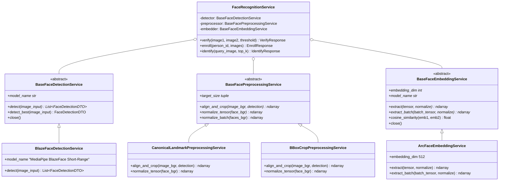

# Hierarchical Face Recognition & Authentication Services

A production-grade Face Detection and Recognition framework built with a **Hierarchical Service Class Architecture**, **Factory Design Pattern**, and **FastAPI REST Endpoints**. Models and preprocessing strategies are swappable via configuration without modifying application logic.

---

## 🏛️ Hierarchical Service Architecture



---

## 📁 Directory Layout

```text
Recognition/
├── src/
│   ├── config.py                     # Central configuration & dynamic model selectors
│   ├── schemas/                      # Pydantic DTOs
│   │   ├── request_schemas.py        # Base64ImagePayload, VerifyBase64Request, EnrollRequest, IdentifyRequest
│   │   └── response_schemas.py       # DetectResponse, CropResponse, VerifyResponse, IdentifyResponse
│   ├── services/                     # Hierarchical Services Layer
│   │   ├── base/                     # Root Abstract Interfaces (ABCs)
│   │   │   ├── base_detection.py     # BaseFaceDetectionService
│   │   │   ├── base_preprocessing.py # BaseFacePreprocessingService
│   │   │   └── base_embedding.py     # BaseFaceEmbeddingService
│   │   ├── detection/                # Detection Backends
│   │   │   ├── blazeface_service.py  # BlazeFaceDetectionService
│   │   │   └── factory.py            # DetectionServiceFactory
│   │   ├── preprocessing/            # Preprocessing Backends
│   │   │   ├── landmark_align_service.py # CanonicalLandmarkPreprocessingService (4-point affine)
│   │   │   ├── bbox_crop_service.py      # BBoxCropPreprocessingService (margin crop)
│   │   │   └── factory.py                # PreprocessingServiceFactory
│   │   ├── embedding/                # Embedding Backends
│   │   │   ├── arcface_service.py    # ArcFaceEmbeddingService (ONNX)
│   │   │   └── factory.py            # EmbeddingServiceFactory
│   │   ├── image_service.py          # Universal image codec (Bytes/Base64/File/Array)
│   │   └── recognition_service.py    # Domain Orchestration Service
│   ├── api/                          # REST API Layer
│   │   ├── app.py                    # FastAPI application & lifecycle
│   │   └── routes.py                 # REST API endpoints
│   └── utils/                        # Utilities
│       ├── image_io.py               # File loading, saving & visualization
│       └── metrics.py                # Evaluation & distance metrics
├── main.py                           # CLI & Web Server runner
├── run_api_demo.py                   # API simulation client faking requests with local Data/
├── requirements.txt                  # Python dependencies
└── README.md                         # Documentation
```

---

## ⚙️ Dynamic Model Switching via Config

You can switch detection, preprocessing, or recognition models in [src/config.py](file:///home/quan/projects/maivenpoint/AI/FaceAuthentication/Recognition/src/config.py) or via environment variables:

```bash
# Switch preprocessing strategy dynamically:
export PREPROCESSING_TYPE="bbox_crop"       # options: landmark_affine, bbox_crop
export DETECTION_BACKBONE="blazeface"       # options: blazeface
export EMBEDDING_BACKBONE="arcface"         # options: arcface

./venv/bin/python main.py --demo
```

---

## 🔌 How to Add a New Model Backend in the Future

Adding a new model (e.g. **RetinaFace**, **SCRFD**, or **AdaFace**) takes only 2 simple steps:

### Step 1: Subclass the Root Base Interface
```python
# src/services/embedding/adaface_service.py
from src.services.base import BaseFaceEmbeddingService

class AdaFaceEmbeddingService(BaseFaceEmbeddingService):
    def __init__(self, model_path=None):
        # Load AdaFace weights...
        pass

    @property
    def model_name(self) -> str:
        return "AdaFace (ResNet-50)"

    @property
    def embedding_dim(self) -> int:
        return 512

    def extract(self, tensor, normalize=True):
        # Run inference...
        return embedding

    def extract_batch(self, batch_tensor, normalize=True):
        return embeddings
```

### Step 2: Register in the Factory
```python
# In src/services/embedding/factory.py
EmbeddingServiceFactory.register("adaface", AdaFaceEmbeddingService)
```
Now setting `export EMBEDDING_BACKBONE="adaface"` automatically activates AdaFace across all API endpoints and CLI commands without touching any existing business logic!

---

## 🚀 Execution Commands

### 1. Run API Simulation Demo (Faking API Requests using `Data/`)
```bash
./venv/bin/python main.py --demo
# or
./venv/bin/python run_api_demo.py
```

### 2. Start Live FastAPI Web Server
```bash
./venv/bin/python main.py --serve --port 8000
```
Swagger UI docs: **`http://localhost:8000/docs`**

### 3. CLI 1:1 Verification
```bash
./venv/bin/python main.py --action verify --img1 Data/duke/duke.jpg --img2 Data/duke/duke1.jpg
```

### 4. CLI Full Dataset Evaluation Matrix
```bash
./venv/bin/python main.py --action all
```
