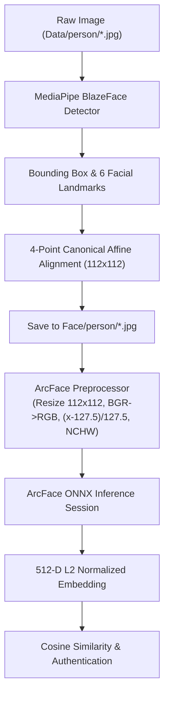

# Face Detection & ArcFace Feature Embedding Pipeline

A clean, modular, and high-performance Python framework for Face Detection, Landmark-guided Face Cropping/Alignment, ArcFace Preprocessing, and 512-Dimensional Deep Feature Embedding Inference.

---

## 📁 Project Architecture & Directory Layout

The project is cleanly split into decoupled modules:

```text
Recognition/
├── Data/                             # Raw input images organized by person
│   ├── duke/                         # Raw photos of Duke
│   ├── kyle/                         # Raw photos of Kyle
│   └── leon/                         # Raw photos of Leon
├── Face/                             # Cropped/Aligned faces organized by person (112x112)
│   ├── duke/
│   ├── kyle/
│   └── leon/
├── models/                           # Pretrained model weights
│   ├── blaze_face_short_range.tflite # MediaPipe BlazeFace face detector
│   ├── w600k_mbf.onnx                # ArcFace MobileFaceNet embedding model (512-D)
│   └── download_models.py            # Automatic model downloader script
├── src/                              # Source modules
│   ├── __init__.py
│   ├── config.py                     # Central configuration (paths, thresholds, target size)
│   ├── detection/                    # Step 1: Face Detection
│   │   ├── __init__.py
│   │   └── blazeface_detector.py     # BlazeFace detector wrapper (bbox & 6 landmarks)
│   ├── preprocessing/                # Step 2: Face Cropping & ArcFace Preprocessing
│   │   ├── __init__.py
│   │   ├── face_cropper.py           # Canonical landmark affine alignment & crop saving
│   │   └── preprocessor.py           # Resize (112x112), BGR->RGB, norm ([-1, 1]), NCHW format
│   ├── embedding/                    # Step 3: ArcFace Deep Feature Inference
│   │   ├── __init__.py
│   │   └── arcface_infer.py          # ArcFace ONNX inference engine (512-D L2 normalized)
│   ├── utils/                        # Utilities
│   │   ├── __init__.py
│   │   ├── image_io.py               # File loading, saving, image directory scanning
│   │   └── metrics.py                # Cosine similarity, distance metrics & verification stats
│   └── pipeline.py                   # End-to-end pipeline coordinator
├── main.py                           # CLI entrypoint
├── requirements.txt                  # Python dependencies
└── README.md                         # Documentation
```

---

## ⚙️ Processing Workflow



1. **Face Detection (`src/detection/`)**:
   - Uses Google's **MediaPipe BlazeFace** short-range detector.
   - Computes bounding boxes and 6 keypoints: Right eye, Left eye, Nose tip, Mouth center, Right ear tragion, Left ear tragion.
2. **Face Cropping & Alignment (`src/preprocessing/face_cropper.py`)**:
   - Extracts detected face and aligns eye centers, nose tip, and mouth center using a 4-point partial affine similarity transformation (`cv2.estimateAffinePartial2D`).
   - Crops directly to canonical ArcFace geometry (112x112) to minimize pose distortion.
   - Saves cropped faces into `Face/<person_name>/<filename>`.
3. **Preprocessing (`src/preprocessing/preprocessor.py`)**:
   - Resizes image to target resolution `(112, 112)`.
   - Converts color format from BGR to RGB.
   - Normalizes pixel values: `(pixel - 127.5) / 127.5` $\in [-1.0, 1.0]$.
   - Shapes into NCHW tensor `(1, 3, 112, 112)` with `float32` precision.
4. **ArcFace Feature Embedding (`src/embedding/arcface_infer.py`)**:
   - Evaluates input through ArcFace backbone via ONNX Runtime.
   - Computes 512-dimensional output embedding and applies L2 normalization ($\|v\|_2 = 1$).
5. **Evaluation & Verification (`src/utils/metrics.py`)**:
   - Computes pairwise cosine similarity matrix.
   - Distinguishes genuine pairs (same person: similarity $\approx 0.50 - 0.82$) from imposter pairs (different people: similarity $\approx 0.00 - 0.35$).

---

## 🚀 Quickstart & Usage

### 1. Installation
Activate the virtual environment and install dependencies:
```bash
./venv/bin/pip install -r requirements.txt
```

### 2. Run Full End-to-End Pipeline
Detects faces from `Data/`, saves aligned crops to `Face/`, extracts embeddings, and displays verification metrics and similarity table:
```bash
./venv/bin/python main.py --action all
```

### 3. Step 1 Only: Face Detection & Cropping
Extracts and saves faces from `Data/` to `Face/`:
```bash
./venv/bin/python main.py --action detect
```

### 4. Step 2 Only: Extract ArcFace Embeddings
Computes embeddings from existing cropped images in `Face/`:
```bash
./venv/bin/python main.py --action embed
```

### 5. Step 3: Compare / Verify Any Two Images
```bash
./venv/bin/python main.py --action verify --img1 Data/duke/duke.jpg --img2 Data/duke/duke1.jpg
```
Output:
```text
Comparing Image 1: Data/duke/duke.jpg
       with Image 2: Data/duke/duke1.jpg

Similarity Score: 0.5353 (Threshold: 0.40)
Verification Result:  MATCH (Same Person)
```

---

## 🐍 Python API Example

```python
from src.detection import BlazeFaceDetector
from src.preprocessing import FaceCropper, FacePreprocessor
from src.embedding import ArcFaceEmbedding
from src.utils import load_image, cosine_similarity

# 1. Initialize modules
detector = BlazeFaceDetector()
cropper = FaceCropper()
preprocessor = FacePreprocessor()
embedder = ArcFaceEmbedding(preprocessor=preprocessor)

# 2. Load raw image & detect face
img_bgr = load_image("Data/duke/duke.jpg")
detection = detector.detect_best(img_bgr)

# 3. Crop & align face (112x112)
aligned_face = cropper.extract_face(img_bgr, detection, use_alignment=True)

# 4. Extract 512-D embedding
embedding = embedder.extract_feature(aligned_face)
print(f"Embedding extracted! Shape: {embedding.shape}")  # (512,)
```
