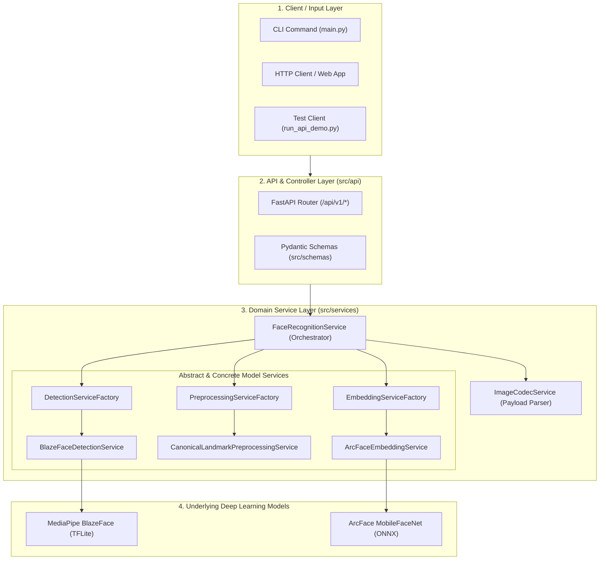

# 🏛️ System Architecture & Design

This document details the architectural principles, layer decomposition, and design patterns utilized in this project.

---

## 🗺️ Architectural Overview

The application follows a **Layered Service-Oriented Architecture** with strict **Dependency Inversion**:

---

## 🧩 Layer Responsibilities

### 1. Schemas Layer (`src/schemas/`)
- Encapsulates Request and Response Data Transfer Objects (DTOs) using **Pydantic**.
- Provides data validation, type enforcement, and OpenAPI documentation generation.
- Decouples external API models from internal computer vision representations.

### 2. Base Services Layer (`src/services/base/`)
- Defines formal Python **Abstract Base Classes (`ABC`)**:
  - `BaseFaceDetectionService`: Contract for face detection algorithms.
  - `BaseFacePreprocessingService`: Contract for alignment, cropping, and normalization.
  - `BaseFaceEmbeddingService`: Contract for deep feature vector extraction.
- Ensures new models can be plugged in without modifying any application code (**Open-Closed Principle**).

### 3. Concrete Model Services
- **Detection (`src/services/detection/`)**:
  - `BlazeFaceDetectionService`: Implements MediaPipe BlazeFace face detection and 6-landmark extraction.
  - `DetectionServiceFactory`: Dynamically instantiates the active detector based on configuration.
- **Preprocessing (`src/services/preprocessing/`)**:
  - `CanonicalLandmarkPreprocessingService`: Applies 4-point partial affine similarity transformation to canonical $(112, 112)$ coordinates and normalizes pixels to $[-1.0, 1.0]$.
  - `BBoxCropPreprocessingService`: Margin-padded bounding box cropping.
  - `PreprocessingServiceFactory`: Creates preprocessing instances dynamically.
- **Embedding (`src/services/embedding/`)**:
  - `ArcFaceEmbeddingService`: Runs ArcFace ONNX inference to yield 512-dimensional L2-normalized feature vectors.
  - `EmbeddingServiceFactory`: Creates embedding extractor instances dynamically.

### 4. Codec Service (`src/services/codec/`)
- `ImageCodecService`: Universal adapter decoding incoming payloads (raw bytes, Base64 strings, file streams, NumPy arrays) into standard OpenCV BGR images and encoding outputs.

### 5. Orchestrator Service (`src/services/orchestrator/`)
- `FaceRecognitionService`: Facade coordinating Detection $\rightarrow$ Alignment $\rightarrow$ Preprocessing $\rightarrow$ ArcFace Inference.
- Manages business workflows:
  - 1:1 Verification (`verify`)
  - Multi-photo Centroid Gallery Enrollment (`enroll`)
  - 1:N Search and Identification (`identify`)

### 6. API Layer (`src/api/`)
- `app.py`: FastAPI application setup, CORS middleware, and service lifecycle management.
- `routes.py`: Clean REST endpoints delegating request processing directly to `FaceRecognitionService`.

---

## 📐 Design Patterns Applied

| Pattern | Where It Is Used | Benefit |
| :--- | :--- | :--- |
| **Service Class Pattern** | All modules under `src/services/` | Single-responsibility business logic isolated from controllers and UI. |
| **Abstract Factory Pattern** | `DetectionServiceFactory`, `EmbeddingServiceFactory`, `PreprocessingServiceFactory` | Dynamically switches model backends via config strings or environment variables. |
| **Dependency Inversion (DIP)** | `FaceRecognitionService` depends on Base ABCs | High-level business logic is decoupled from specific deep learning frameworks. |
| **Facade Pattern** | `FaceRecognitionService` | Hides complex multi-stage pipeline orchestration behind simple business methods. |
| **DTO (Data Transfer Object)** | `src/schemas/` | Standardizes API contracts and ensures clean separation of data and logic. |
