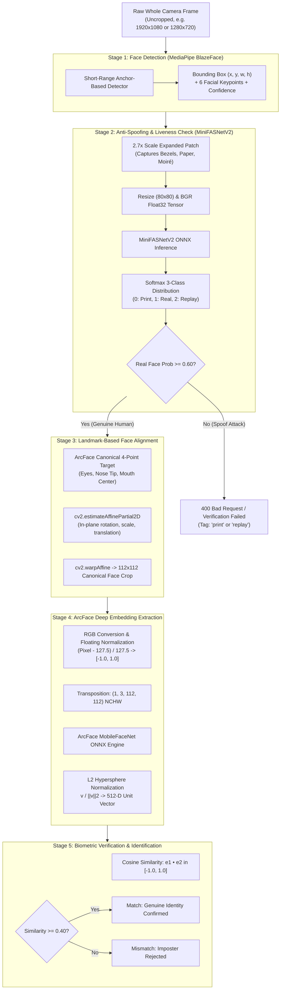
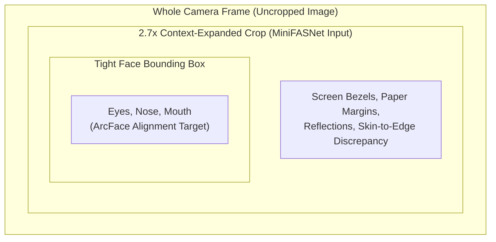

# 🔬 Face Processing Pipeline: Detection, Anti-Spoofing, Alignment & Recognition

This document provides a comprehensive, step-by-step technical breakdown of the complete facial biometric authentication pipeline, from raw camera frames to 512-D ArcFace feature embeddings and similarity matching.

---

## 🔄 End-to-End Pipeline Workflow



---

## 📸 Stage 1: Face Detection (MediaPipe BlazeFace)

### Goal
Detect human faces in unconstrained input images with sub-millisecond latency and produce keypoint anchors for both context expansion and alignment.

### Mechanism
- **Model**: Google **MediaPipe BlazeFace** (short-range anchor-based MobileNet detector optimized for mobile and edge CPUs).
- **Inputs**: Full, uncropped camera frame (RGB or BGR).
- **Outputs**:
  1. **Bounding Box**: `(origin_x, origin_y, width, height)` in pixel coordinates.
  2. **Confidence Score**: Detection probability in range $[0.0, 1.0]$ (minimum acceptance threshold: $0.50$).
  3. **6 Facial Keypoints**:
     - Right Eye pupil (viewer's left)
     - Left Eye pupil (viewer's right)
     - Nose Tip
     - Mouth Center
     - Right Ear Tragion
     - Left Ear Tragion

---

## 🛡️ Stage 2: Face Anti-Spoofing & Liveness (MiniFASNetV2)

### Why Anti-Spoofing Must Ingest the Whole Uncropped Image
Spoof attacks (e.g. 2D photo prints, tablet/phone screen replay attacks, cut-out masks) cannot be reliably detected from a tightly cropped face alone:
1. **Device Bezels & Display Frames**: Tablet edges, smartphone borders, or printed photo margins live in the perimeter around the head.
2. **Environmental & Lighting Mismatch**: Discrepancies between screen backlight reflections and ambient scene lighting exist outside the face oval.
3. **Moiré Frequency & Specular Highlights**: High-frequency grid interference patterns from digital screens require spatial contextual frequency cues.



### Mechanism
- **Model Architecture**: **MiniFASNetV2** (lightweight deep CNN with Central Difference Convolutional layers designed for Silent Face Anti-Spoofing).
- **Scale Factor Expansion**:
  $$\text{scale} = \min\left(\frac{H_{\text{img}} - 1}{h_{\text{bbox}}}, \min\left(\frac{W_{\text{img}} - 1}{w_{\text{bbox}}}, 2.7\right)\right)$$
  - Expands the bounding box around face center $(c_x, c_y)$ by $2.7\times$ to encompass forehead, chin, hair, and surrounding borders.
- **Input Preprocessing**:
  - Image Format: Raw **BGR** `float32` in range $[0.0, 255.0]$ (no $[-1, 1]$ normalization).
  - Target Resolution: Resized to $(80 \times 80)$ pixels via area interpolation (`cv2.INTER_AREA`).
  - Tensor Shape: NCHW `(1, 3, 80, 80)`.
- **Classification Output**: 3 logits converted to probabilities via numerically stable softmax:
  $$\mathbf{p} = \text{Softmax}(\mathbf{z}) = \left[p_{\text{print}}, p_{\text{real}}, p_{\text{replay}}\right]$$
  - Index 0: 2D Printed Photo Attack
  - Index 1: Genuine Living Human Face
  - Index 2: 2D Screen Replay Attack
- **Decision Boundary**:
  - **Real Face**: $p_{\text{real}} \ge 0.60$ (configured via `LIVENESS_THRESHOLD`).
  - **Spoof Attack**: $p_{\text{real}} < 0.60$. The attack type is flagged as `"print"` if $p_{\text{print}} > p_{\text{replay}}$, otherwise `"replay"`.

---

## 📐 Stage 3: Landmark-Based Face Alignment

### Why Alignment is Crucial
Raw photos have variations in head roll (tilt), pitch, yaw, camera distance, and off-center positioning. Passing unaligned crops into a deep recognition network creates severe feature distortion and degrades cosine similarity.

### Canonical ArcFace Geometry
We utilize a **4-point partial affine similarity transformation** (`cv2.estimateAffinePartial2D`) that solves for optimal 2D rotation $\theta$, translation $(t_x, t_y)$, and uniform scaling $s$:

$$\begin{bmatrix} x' \\ y' \end{bmatrix} = \begin{bmatrix} s \cos\theta & -s \sin\theta \\ s \sin\theta & s \cos\theta \end{bmatrix} \begin{bmatrix} x \\ y \end{bmatrix} + \begin{bmatrix} t_x \\ t_y \end{bmatrix}$$

This aligns the detected keypoints with the canonical ArcFace reference coordinates defined on a standard **$112 \times 112$ canvas**:

| Landmark Anchor | Canonical Coordinate $(x, y)$ on $112 \times 112$ Canvas |
| :--- | :---: |
| **Right Eye** (viewer's left) | $(38.29, 51.70)$ |
| **Left Eye** (viewer's right) | $(73.53, 51.70)$ |
| **Nose Tip** | $(56.03, 71.74)$ |
| **Mouth Center** | $(56.03, 92.37)$ |

```text
       (38.29, 51.70)  👁️        👁️  (73.53, 51.70)
                              👃 (56.03, 71.74)
                              👄 (56.03, 92.37)
```

The resulting warped image is precisely cropped to **$112 \times 112 \times 3$ pixels**.

---

## 🎨 Stage 4: ArcFace Deep Embedding Extraction

### 1. Preprocessing & Tensor Normalization
1. **Color Space**: OpenCV processes in BGR; ArcFace requires **RGB**:
   $$\text{Img}_{\text{RGB}} = \text{cv2.cvtColor}(\text{Img}_{\text{BGR}}, \text{cv2.COLOR\_BGR2RGB})$$
2. **Float32 Normalization**: Scales pixel values from uint8 $[0, 255]$ to $[-1.0, 1.0]$:
   $$\mathbf{X} = \frac{\text{Img}_{\text{RGB}} - 127.5}{127.5}$$
3. **Channel Transposition**: Reorders HWC $(112, 112, 3) \rightarrow$ CHW $(3, 112, 112)$.
4. **Batch Dimension**: Expands to NCHW $(1, 3, 112, 112)$.

### 2. Deep Feature Vector Extraction
The normalized tensor is fed into the **ArcFace MobileFaceNet ONNX** inference session, mapping high-dimensional pixel patterns to a dense 512-dimensional feature vector:
$$\mathbf{v} = f_{\text{ArcFace}}(\mathbf{X}) \in \mathbb{R}^{512}$$

### 3. L2 Hypersphere Normalization
To enable distance and similarity evaluation using standard inner products, the vector is normalized to lie on the unit hypersphere $\mathbb{S}^{511}$:
$$\mathbf{e} = \frac{\mathbf{v}}{\|\mathbf{v}\|_2} = \frac{\mathbf{v}}{\sqrt{\sum_{i=1}^{512} v_i^2}}, \quad \|\mathbf{e}\|_2 = 1.0$$

---

## 🎯 Stage 5: Biometric Verification & Identification

### 1. Cosine Similarity Metric
Because embeddings $\mathbf{e}_1$ and $\mathbf{e}_2$ have unit length ($\|\mathbf{e}_1\| = \|\mathbf{e}_2\| = 1$), their cosine similarity equals their standard dot product:
$$\text{Similarity}(\mathbf{e}_1, \mathbf{e}_2) = \cos(\theta) = \mathbf{e}_1 \cdot \mathbf{e}_2 = \sum_{i=1}^{512} e_{1, i} \cdot e_{2, i} \in [-1.0, 1.0]$$

### 2. Decision Thresholds & Empirical Distribution
- **Default Acceptance Threshold**: $\tau = 0.40$ (configured via `DEFAULT_SIMILARITY_THRESHOLD`).
- **Score Distributions**:
  - **Same Person (Genuine Match)**: Typically **$0.55 - 0.85$**
  - **Different Persons (Imposter)**: Typically **$-0.10 - 0.28$**
  - **Borderline Ambiguity Zone**: **$0.35 - 0.42$** (triggers secondary review or retry)

### 3. Operations Supported
1. **1:1 Verification (`/api/v1/verify`)**:
   - Compares probe photo against reference photo.
   - Evaluates liveness on both photos (if enabled).
   - Returns boolean `match`, similarity score, and liveness audit details.
2. **Pure Live Embedding Extraction (`/api/v1/embedding/live`)**:
   - Accepts raw whole image $\rightarrow$ verifies liveness $\rightarrow$ aligns $\rightarrow$ returns raw `512-D` vector $\mathbf{e}$.
   - Immediately aborts with `HTTP 400 Bad Request` if liveness confidence $< 0.60$.
3. **1:N Identification (`/api/v1/identify`)**:
   - Computes cosine similarity of probe embedding against all enrolled gallery identities.
   - Returns top match ranking above threshold $\tau$.

---

## ⚙️ Summary Table of Pipeline Stages

| Stage | Component | Input | Output | Tensor Shape |
| :---: | :--- | :--- | :--- | :---: |
| **1** | **BlazeFace Detection** | Raw Whole Image (BGR) | BBox + 6 Landmarks | $H \times W \times 3$ |
| **2** | **MiniFASNetV2 Liveness** | $2.7\times$ Expanded BBox Context | Real vs Spoof Probabilities | $(1, 3, 80, 80)$ |
| **3** | **4-Point Affine Alignment** | Image + Keypoints | Canonical Face Crop | $(112, 112, 3)$ |
| **4** | **ArcFace Feature Extraction** | Canonical Aligned Crop (RGB) | 512-D Normalized Vector | $(1, 3, 112, 112) \rightarrow \mathbb{R}^{512}$ |
| **5** | **Biometric Matching** | Two 512-D Unit Vectors | Cosine Similarity Score $\in [-1, 1]$ | Scalar |

---

## 🔗 Related Documentation
- 📘 [Universal Design Pattern Blueprint](file:///home/quan/projects/maivenpoint/AI/FaceAuthentication/Recognition/docs/DESIGNPATTERN.md)
- 📡 [REST API Reference](file:///home/quan/projects/maivenpoint/AI/FaceAuthentication/Recognition/docs/API_REFERENCE.md)
- 🏛️ [System Architecture & Design](file:///home/quan/projects/maivenpoint/AI/FaceAuthentication/Recognition/docs/ARCHITECTURE.md)
- 🚀 [Getting Started & Installation Guide](file:///home/quan/projects/maivenpoint/AI/FaceAuthentication/Recognition/docs/GETTING_STARTED.md)
