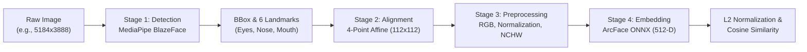

# 🔬 Face Processing Pipeline Explained

This document provides an intuitive, step-by-step technical breakdown of how a raw image is transformed into a facial embedding and matched.

---

## 🔄 End-to-End Pipeline Workflow



---

## 📸 Stage 1: Face Detection (MediaPipe BlazeFace)

### Goal
Locate human faces in unconstrained photos and identify crucial facial landmarks.

### Mechanism
- **Detector Architecture**: Google **MediaPipe BlazeFace** short-range detector (lightweight compact anchor-based MobileNet).
- **Outputs**:
  1. **Bounding Box**: `(origin_x, origin_y, width, height)` in pixels.
  2. **Confidence Score**: Probability between `0.0` and `1.0`.
  3. **6 Facial Keypoints**:
     - Right Eye (viewer's left)
     - Left Eye (viewer's right)
     - Nose Tip
     - Mouth Center
     - Right Ear Tragion
     - Left Ear Tragion

---

## 📐 Stage 2: Landmark-Based Face Alignment

### Why Alignment is Crucial
Raw photos often have varying head tilt (roll), head turning (yaw), distance, and centering. Feeding unaligned faces into deep CNNs leads to feature distortion. 

### Mechanism
We use a **4-point partial affine similarity transformation** (`cv2.estimateAffinePartial2D`) that computes the optimal translation, in-plane rotation, and uniform scale to align the detected facial landmarks with canonical ArcFace coordinates on a $112 \times 112$ canvas:

$$\text{Canonical ArcFace Reference Points } (112 \times 112):$$
- **Right Eye**: $(38.29, 51.70)$
- **Left Eye**: $(73.53, 51.70)$
- **Nose Tip**: $(56.03, 71.74)$
- **Mouth Center**: $(56.03, 92.37)$

```text
       (38.29, 51.70)  👁️        👁️  (73.53, 51.70)
                              👃 (56.03, 71.74)
                              👄 (56.03, 92.37)
```

The resulting face is cropped and aligned directly to **$112 \times 112$ pixels**.

---

## 🎨 Stage 3: ArcFace Preprocessing

### Goal
Convert the aligned BGR crop into the exact numerical tensor format expected by the pretrained ArcFace convolutional neural network.

### Steps:
1. **Resolution Check**: Ensure image is exactly $(112, 112, 3)$.
2. **Color Space Conversion**: OpenCV loads images in **BGR** format; ArcFace requires **RGB**:
   $$\text{Image}_{\text{RGB}} = \text{cv2.cvtColor}(\text{Image}_{\text{BGR}}, \text{cv2.COLOR\_BGR2RGB})$$
3. **Floating-Point Conversion & Normalization**: Convert uint8 $[0, 255]$ pixels to float32 normalized values in range $[-1.0, 1.0]$:
   $$\text{Normalized Pixel} = \frac{\text{Pixel} - 127.5}{127.5}$$
4. **Channel Transposition**: Reorder channels from HWC $(112, 112, 3)$ to CHW $(3, 112, 112)$.
5. **Batch Dimension**: Expand dimensions to NCHW $(1, 3, 112, 112)$.

---

## 🧠 Stage 4: ArcFace Deep Embedding & Matching

### 1. Feature Extraction
The $(1, 3, 112, 112)$ tensor is passed into the ArcFace ONNX inference engine. The network compresses the high-dimensional visual information into a dense **512-dimensional vector** $\mathbf{v} \in \mathbb{R}^{512}$.

### 2. L2 Normalization
The vector is normalized to lie on the surface of a unit hypersphere ($\|\mathbf{e}\|_2 = 1$):
$$\mathbf{e} = \frac{\mathbf{v}}{\|\mathbf{v}\|_2}$$

### 3. Cosine Similarity Matching
Because both vectors are L2-normalized, the cosine similarity between two face embeddings $\mathbf{e}_1$ and $\mathbf{e}_2$ is simply their inner product:
$$\text{Similarity}(\mathbf{e}_1, \mathbf{e}_2) = \mathbf{e}_1 \cdot \mathbf{e}_2 = \sum_{i=1}^{512} e_{1, i} \cdot e_{2, i} \in [-1.0, 1.0]$$

### 4. Decision Logic
- **Same Person (Genuine Pair)**: Similarity $\ge 0.40$ (typically $0.50 - 0.82$)
- **Different Person (Imposter Pair)**: Similarity $< 0.40$ (typically $0.00 - 0.30$)
