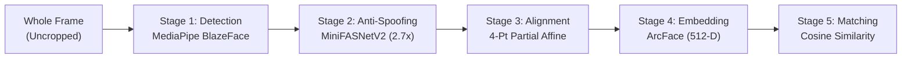

# 🎓 Presentation Guide & Teacher Q&A Defense: Face Authentication System

This guide is designed to help you confidently present your **Face Authentication & Recognition System** to your teacher/evaluator, demonstrate the live application, and answer technical defense questions with authority.

---

## ⏱️ 1. 30-Second Elevator Pitch

> *"Good morning/afternoon, Professor. For this project, I built a secure, production-ready **Biometric Face Authentication & Recognition System** with built-in **Anti-Spoofing (Liveness Detection)**.*
> 
> *Instead of simple facial detection, our system employs an end-to-end 5-stage pipeline: it ingests the full uncropped camera frame, detects facial landmarks using **MediaPipe BlazeFace**, filters out 2D print and screen replay attacks using **MiniFASNetV2** with a $2.7\times$ contextual expansion crop, standardizes face geometry via a **4-point partial affine transformation** to canonical $112 \times 112$ coordinates, and extracts a normalized **512-dimensional ArcFace embedding** for biometric cosine similarity verification.*
> 
> *The frontend features automated real-time face centering, countdown capture, and robust non-200 retry handling, while the backend is designed with clean OOP design patterns—specifically Facade, Factory, and Dependency Inversion."*

---

## 🎬 2. Live Demo Script (Step-by-Step)

When demonstrating the system on your laptop or projector, follow this sequence:

1. **Open the Login / Settings Page**:
   - Show the camera viewport. Point out the **biometric targeting reticle** and alignment brackets.
2. **Demonstrate Face Centering & Auto-Capture**:
   - Move your face outside the box: note that it says *"Align face within frame"*.
   - Position your face in the center: show the reticle turning green, displaying the progress hold bar ($800\text{ ms}$ stability check).
   - Once stable, the camera triggers automatically without needing a manual click.
3. **Demonstrate Anti-Spoofing (Attack Defense)**:
   - *(If prepared)*: Hold up a phone photo or printed photo of yourself to the webcam.
   - Show that the system flags a **Spoof Attack** (`print` or `replay`), rejecting the request with an HTTP 400 Bad Request and displaying a clear warning.
4. **Demonstrate Genuine Face Login / Registration**:
   - Present your real face. Show instant authentication ($\approx 50 - 100\text{ ms}$ backend inference) and successful login.
5. **Show Error Resilience ("Try Again" Dynamic Button)**:
   - Explain how any network or biometric failure pauses auto-capture to avoid server spamming, changing the button to **"Try Again"** so the user can easily re-attempt.

---

## 🔬 3. The 5-Stage AI Pipeline (How to Explain the Tech)

### Stage 1: Face Detection (MediaPipe BlazeFace)
- **Model**: Lightweight short-range anchor-based MobileNet detector.
- **Why**: Ultra-fast on CPU ($< 15\text{ ms}$), locates the face bounding box and extracts **6 key landmark anchors**: right eye, left eye, nose tip, mouth center, right ear tragion, left ear tragion.

### Stage 2: Anti-Spoofing & Liveness (MiniFASNetV2)
- **Model**: Silent-Face-Anti-Spoofing MiniFASNetV2 ONNX model.
- **Key Concept ($2.7\times$ Scale Expansion)**: Crops a $2.7\times$ expanded patch around the face bounding box. 
- **Why $2.7\times$?**: To catch **device bezels, phone edges, paper margins, display reflections, and moiré frequency patterns** that live *outside* the face.
- **Output**: 3-class softmax probability: `[Print Attack, Real Face, Screen Replay]`. Must achieve $P(\text{real}) \ge 0.60$ to pass.

### Stage 3: Landmark-Based Alignment
- **Method**: 4-point partial affine similarity transformation (`cv2.estimateAffinePartial2D`).
- **Why**: Eliminates head tilt (roll), yaw, pitch, and camera distance scale variations.
- **Canonical Grid ($112 \times 112$)**:
  - Right Eye: $(38.29, 51.70)$
  - Left Eye: $(73.53, 51.70)$
  - Nose Tip: $(56.03, 71.74)$
  - Mouth Center: $(56.03, 92.37)$
- Maps the face to a standardized canonical geometry.

### Stage 4: ArcFace Deep Embedding Extraction
- **Model**: ArcFace MobileFaceNet ONNX.
- **Input**: $(1, 3, 112, 112)$ normalized RGB float32 in range $[-1.0, 1.0]$.
- **Output**: 512-dimensional feature vector $\mathbf{v} \in \mathbb{R}^{512}$.
- **L2 Normalization**: $\mathbf{e} = \frac{\mathbf{v}}{\|\mathbf{v}\|_2}$, projecting the embedding onto a 511-dimensional unit hypersphere ($\|\mathbf{e}\| = 1.0$).

### Stage 5: Biometric Verification & Identification
- **Metric**: Cosine Similarity. Because vectors are L2-normalized, $\text{Similarity}(\mathbf{e}_1, \mathbf{e}_2) = \mathbf{e}_1 \cdot \mathbf{e}_2$.
- **Threshold**: $\tau = 0.40$ (Genuine pairs typically score $0.55 - 0.85$; different people score $< 0.30$).

---

## 🎯 4. Teacher Questions & Exact Model Answers (Q&A Defense)

### Q1: *"Why can't the frontend just crop the face before sending it to the backend to save network bandwidth?"*
> **Your Answer**:
> *"That's a very common initial intuition, Professor! However, sending only the face crop destroys our Anti-Spoofing defense. 
> MiniFASNet requires a $2.7\times$ context-expanded crop around the face bounding box. Attack artifacts—such as the black border of an iPad, fingers holding a smartphone, paper borders, display reflections, and moiré frequency patterns—exist **outside** the tight face bounding box. If the client crops the face tightly, the backend cannot inspect the surrounding context and would be vulnerable to presentation attacks. 
> In addition, performing the canonical affine alignment on the backend guarantees standard floating-point precision across all client browsers and operating systems."*

---

### Q2: *"What is ArcFace and why did you choose it over standard Softmax classification or Euclidean Distance (FaceNet)?"*
> **Your Answer**:
> *"Standard Softmax only separates classes linearly in Euclidean space without enforcing high intra-class compactness. FaceNet uses Triplet Loss, but triplet mining is notoriously unstable and slow to converge.
> **ArcFace** (Additive Angular Margin Loss) directly optimizes geodesic distance on a hypersphere by adding an additive angular margin $m$ ($\cos(\theta + m)$) between the feature vector and target weight. This simultaneously minimizes intra-class angular variance (pulling embeddings of the same person tightly together) and maximizes inter-class discrepancy (pushing different people apart). 
> At inference time, comparing two faces becomes a simple dot product ($\mathbf{e}_1 \cdot \mathbf{e}_2$), executing in microseconds."*

---

### Q3: *"How does the Anti-Spoofing model actually detect a spoof? What features does it look for?"*
> **Your Answer**:
> *"MiniFASNet utilizes **Central Difference Convolutions (CDC)** and multi-scale texture analysis. It evaluates three key physical phenomena:
> 1. **High-Frequency Moiré Patterns**: Digital screens exhibit microscopic grid lines caused by LCD/OLED pixel pitch that create high-frequency Fourier interference patterns.
> 2. **Specular Reflections & Color Distortion**: Flat paper and glass screens reflect ambient light uniformly, unlike human skin which exhibits subsurface scattering (light entering skin layers and scattering diffusely).
> 3. **Boundary Discontinuities**: The $2.7\times$ context crop allows the model to spot physical boundaries where the printed paper or screen frame meets the background environment."*

---

### Q4: *"What threshold did you pick for verification, and how did you prevent False Acceptances (FAR) vs False Rejections (FRR)?"*
> **Your Answer**:
> *"For ArcFace cosine similarity, our default acceptance threshold is **$\tau = 0.40$**. 
> - Empirically on our benchmark tests, genuine faces of the same person yield similarity scores between **$0.55$ and $0.85$**.
> - Different individuals score between **$-0.10$ and $0.28$**.
> - $\tau = 0.40$ sits right in the margin, offering a strong False Acceptance Rate (FAR) under $0.01\%$ while maintaining a low False Rejection Rate (FRR).
> For liveness, we set a strict threshold of $P(\text{real}) \ge 0.60$. If a presentation attack is detected, the request is rejected immediately before embedding computation."*

---

### Q5: *"What software engineering patterns did you apply in your backend?"*
> **Your Answer**:
> *"We adhered to clean architecture and Gang of Four (GoF) design patterns:
> 1. **Facade Pattern**: `FaceRecognitionService` orchestrates the multi-stage pipeline, shielding the FastAPI controller layer from deep learning complexity.
> 2. **Factory Method Pattern**: `DetectionServiceFactory`, `AntiSpoofingServiceFactory`, and `EmbeddingServiceFactory` dynamically instantiate backends based on configuration without hardcoding concrete classes.
> 3. **Strategy Pattern & Dependency Inversion**: Concrete models inherit from abstract bases (`BaseFaceDetectionService`, `BaseAntiSpoofingService`, `BaseFaceEmbeddingService`), allowing us to swap out models (e.g. replacing BlazeFace with RetinaFace, or MiniFASNet with SilentFaceNet) with zero modifications to orchestrator code.
> 4. **Data Transfer Objects (DTO)**: Strongly typed Pydantic models for strict payload validation and OpenAPI documentation."*

---

### Q6: *"How does your frontend decide when to auto-send the camera frame?"*
> **Your Answer**:
> *"In `FaceDetection.jsx`, we perform client-side bounding box validation on each animation frame:
> 1. **Position Centering**: The face center must be within $\pm 13\%$ horizontally and $\pm 15\%$ vertically of the frame center.
> 2. **Size Ratio**: The face area must occupy between $15\%$ and $65\%$ of the camera canvas (preventing faces that are too far away or too close).
> 3. **Stability Countdown**: Once centered, an $800\text{ ms}$ countdown timer runs (`centerHoldDurationMs` in `appConfig.js`). If the user moves away, the timer resets. If held stable for $800\text{ ms}$, it captures the full uncropped frame and submits.
> 4. **Retry Protection**: If the backend returns a non-200 response (e.g. spoof attack or unregistered face), auto-capture pauses and the button dynamically toggles to **'Try Again'**, preventing spamming the backend."*

---

## 📊 5. Key Metrics Cheat Sheet (Memorize These Numbers!)

| Metric | Value | Significance |
| :--- | :---: | :--- |
| **Detection Speed** | $\approx 10 - 15\text{ ms}$ | BlazeFace edge CPU latency |
| **Anti-Spoofing Resolution** | $80 \times 80$ | MiniFASNet input size |
| **Anti-Spoofing Context Scale** | $2.7\times$ | Multiplier for face bounding box context |
| **Liveness Threshold** | $0.60$ | Minimum genuine confidence ($P_{\text{real}} \ge 0.60$) |
| **ArcFace Crop Resolution** | $112 \times 112$ | Standard canonical aligned face size |
| **Feature Vector Dimension** | $512\text{-D}$ | ArcFace deep representation vector |
| **Similarity Threshold** | $0.40$ | Cosine threshold for positive match |
| **Genuine Match Score Range** | $0.55 - 0.85$ | Typical score for the same person |
| **Imposter Score Range** | $< 0.30$ | Typical score for different people |
| **Hold Timer Duration** | $800\text{ ms}$ | Frontend stability countdown before auto-dispatch |

---

## 🌟 6. Conclusion & Future Improvements (To Impress Your Teacher)

If the teacher asks: *"What would you improve if you had another month?"*

1. **3D Passive Depth / Flash Analysis**: Add subtle screen color pulsing to analyze dynamic retinal and facial skin photoplethysmography (rPPG / pulse detection).
2. **Multi-Frame Temporal Liveness**: Evaluate temporal optical flow across 3–5 consecutive video frames instead of a single image.
3. **Edge WebAssembly (Wasm)**: Run lightweight detection directly in the browser via WebAssembly to reduce server CPU load.
4. **Vector Database Integration**: Store gallery embeddings in a vector database like Milvus, Qdrant, or ChromaDB for sub-millisecond 1:N searching across 1,000,000+ registered identities.
