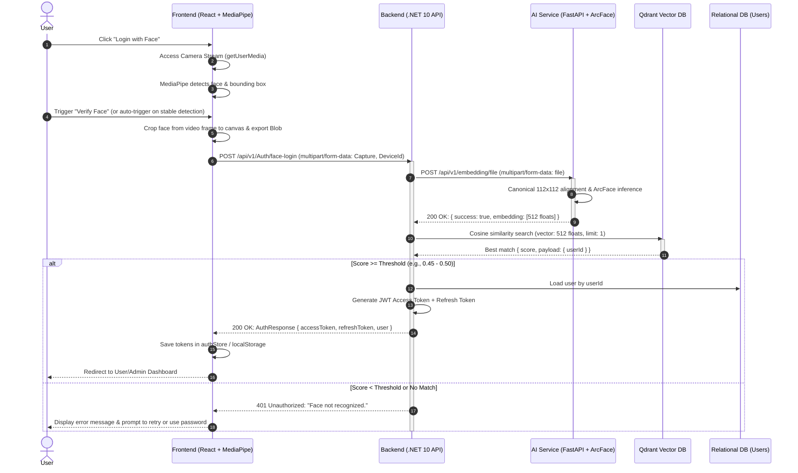

# Face Authentication Architecture & Integration Flow

This document details the end-to-end Face Authentication flow across the three system layers:
1. **Front-end Client** (React + MediaPipe BlazeFace)
2. **Back-end Core API** (.NET 10 Web API + Qdrant Vector Search)
3. **AI Microservice** (FastAPI + ArcFace ONNX)

---

## 1. High-Level Architecture Diagram



---

## 2. Step-by-Step Flow Specification

### Phase 1: Client Face Detection & Cropping (Frontend)
1. **Webcam Initialization:** 
   * Frontend invokes `navigator.mediaDevices.getUserMedia({ video: { facingMode: 'user' } })`.
   * Stream is attached to an HTML `<video>` element.
2. **Real-time Face Detection:**
   * `@mediapipe/tasks-vision` BlazeFace runs continuously via `requestAnimationFrame`.
   * Detects face bounding box `(originX, originY, width, height)` and 6 facial landmarks (eyes, nose, mouth corners, tragions).
   * Displays visual feedback overlay (bounding box + confidence score) on `<canvas>`.
3. **Snapshot & Bounding-Box Cropping:**
   * When single face is detected with high confidence (`>= 0.5`), the client takes a snapshot.
   * Rather than sending the full background video frame (1280x720), the client crops the detected face region with ~15–20% padding onto an offscreen canvas.
   * Converts the canvas content to a JPEG/PNG `Blob` (`canvas.toBlob()`).

### Phase 2: Request Dispatch (.NET Backend)
1. **Payload Construction:**
   * Frontend builds a `FormData` object:
     * `Capture`: Image Blob (`image/jpeg`).
     * `DeviceId`: Client device / browser fingerprint.
2. **API Endpoint:**
   * Sent to `POST /api/v1/Auth/face-login`.
   * Received by `AuthController` and passed to `IFaceAuthenticateService.FaceAuthenticateAsync(request)`.

### Phase 3: Embedding Extraction (Python AI Service)
1. **Internal Service Call:**
   * .NET backend forwards the raw image stream to the FastAPI microservice via `FaceRecognitionClient`:
     * Target: `POST http://<ai-service-host>/api/v1/embedding/file`.
     * Multipart field name: `file`.
2. **ArcFace Pipeline:**
   * Python FastAPI receives the image bytes.
   * The pipeline aligns the face to canonical 112x112 coordinates using landmarks.
   * Passes the aligned face through the ArcFace ONNX model.
   * Returns an L2-normalized 512-dimensional vector.
3. **Response to .NET:**
   * JSON: `{ "success": true, "embedding_dim": 512, "embedding": [f_0, f_1, ..., f_511] }`.

### Phase 4: Vector Search & Identity Resolution (Qdrant)
1. **Cosine Similarity Query:**
   * `FaceEmbeddingRepository` queries Qdrant with the 512-D vector:
     * Metric: `Cosine`.
     * Limit: `1` (nearest neighbor).
     * Threshold: `0.45` – `0.50` (calibrated for ArcFace cosine similarity).
2. **Match Evaluation:**
   * If a match exists above the threshold, Qdrant returns point payload containing the registered `userId`.
   * If no vector passes the threshold, a `401 Unauthorized ("Face not recognized.")` is returned.
3. **Token Issuance:**
   * Backend queries the User database for `userId`.
   * Generates JWT Access Token and Refresh Token.
   * Returns `AuthResponse` to the client.

### Phase 5: Client Session Setup
1. **Session Storage:**
   * Frontend stores `accessToken` and `refreshToken` in `authStore` and `localStorage`.
2. **Navigation:**
   * If `user.role === 'Admin'`, redirects to Admin Portal.
   * Otherwise, redirects to Student Portal / Home.

---

## 3. Data Contracts & Schemas

### 1. Frontend to Backend (`POST /api/v1/Auth/face-login`)
* **Content-Type:** `multipart/form-data`
* **Form Fields:**
  | Field | Type | Description |
  |---|---|---|
  | `Capture` | `File` (Binary) | Cropped facial photo (JPEG/PNG) |
  | `DeviceId` | `String` | Device identifier / User-Agent |

### 2. Backend to AI Service (`POST /api/v1/embedding/file`)
* **Content-Type:** `multipart/form-data`
* **Form Fields:**
  | Field | Type | Description |
  |---|---|---|
  | `file` | `UploadFile` (Binary) | Image file stream |
* **Response Body (`200 OK`):**
  ```json
  {
    "success": true,
    "embedding_dim": 512,
    "embedding": [0.0341, -0.0125, 0.0892, "... 512 floats ..."]
  }
  ```

### 3. Backend to Qdrant Search
* **Search Request:**
  ```json
  {
    "vector": [0.0341, -0.0125, 0.0892, "..."],
    "limit": 1,
    "score_threshold": 0.45
  }
  ```
* **Stored Point Payload in Qdrant:**
  ```json
  {
    "id": "<user-guid>",
    "payload": {
      "userId": "<user-guid>",
      "dimension": 512,
      "createdAt": "2026-09-25T00:00:00Z"
    }
  }
  ```

### 4. Backend to Frontend (`AuthResponse`)
* **Response Body (`200 OK`):**
  ```json
  {
    "accessToken": "eyJhbGciOi...",
    "expiresAt": "2026-09-25T01:00:00Z",
    "refreshToken": "d8e3b..."
  }
  ```

---

## 4. Error Handling & Edge Cases

| Failure Scenario | Layer | Behavior / Response | Client UI Action |
|---|---|---|---|
| No face in webcam frame | Frontend | Capture button disabled | Shows "Looking for face..." indicator |
| Multiple faces in frame | Frontend | Prevents submission | Prompts "Ensure only one face is visible" |
| Face not registered in Qdrant | Backend / Qdrant | Returns `401 Unauthorized` ("Face not recognized.") | Alerts user to retry or log in with password |
| Similarity score below threshold | Backend | Returns `401 Unauthorized` | Alerts user to adjust lighting/face angle |
| AI Service offline / timed out | Backend | Returns `502 Bad Gateway` / `500 Internal Error` | Shows service temporarily unavailable |
| Camera permission denied | Frontend | Browser alert / MediaDevices error | Displays "Camera access denied. Please grant permission." |

---

## 5. Component Checklist for Implementation

- [ ] **Frontend (`FaceDetection.jsx`):** Add `useImperativeHandle` with `captureCroppedFace(): Promise<Blob>` method.
- [ ] **Frontend (`LoginForm.jsx`):** Wire `handleFaceLogin` to call `captureCroppedFace()`, assemble `FormData`, and invoke API.
- [ ] **Frontend (`auth.api.js`):** Add `faceLogin(formData)` calling `POST /api/v1/Auth/face-login`.
- [ ] **Backend (`AuthController.cs`):** Add `[HttpPost("face-login")]` endpoint injecting `IFaceAuthenticateService`.
- [ ] **Backend (`appsettings.json`):** Add `"FaceRecognition": { "BaseUrl": "http://localhost:8000", "ExtractEmbeddingEndpoint": "/api/v1/embedding/file" }`.
- [ ] **Backend (`FaceEmbeddingRepository.cs`):** Calibrate `threshold` to `0.45f - 0.50f`.
- [ ] **AI Service (`FastAPI`):** Confirm `/api/v1/embedding/file` is up and accepting multipart file uploads.
